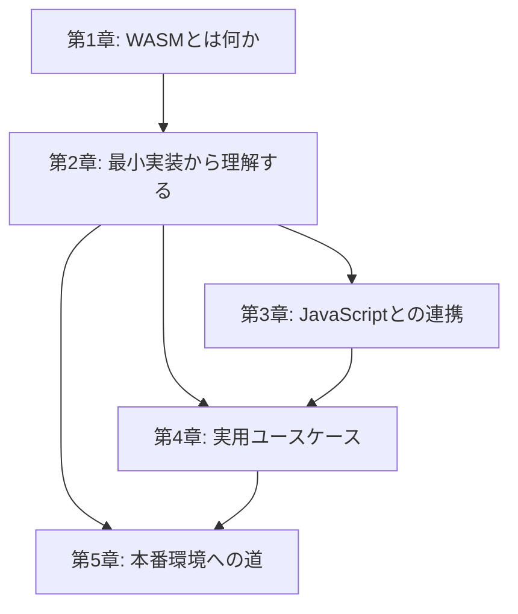

# 書籍構成・章間依存関係図 (Book Architecture)

## 章間依存関係図



## 依存関係の説明

| 章 | 前提となる章 | 関係の説明 |
|----|------------|-----------|
| 第2章 | 第1章 | WASMの概念理解が実装の前提 |
| 第3章 | 第2章 | wasm-packでのビルド経験がJS連携の前提 |
| 第4章 | 第2章, 第3章 | 実装基礎とJS連携の知識が実用例の前提 |
| 第5章 | 第2章, 第4章 | ビルド経験と実用例の知識が本番運用の前提 |

## 読者の学習パス

本書は全5章を順番に読み進める**線形構成**を基本とする。50ページのコンパクトな構成のため、章の飛ばし読みは推奨しない。

```
第1章（概念） → 第2章（実装基礎） → 第3章（JS連携） → 第4章（実用例） → 第5章（本番運用）
```

## 各章の役割

| 章 | 役割 | インプット | アウトプット |
|----|------|----------|------------|
| 第1章 | 動機づけと概念理解 | WASMへの興味 | WASMの本質の理解 |
| 第2章 | 開発環境構築と初回実装 | 概念の理解 | 動作するWASMモジュール |
| 第3章 | ブラウザ連携の実践 | WASMモジュール | JS-WASM連携アプリ |
| 第4章 | ユースケース別の実装 | 基礎実装力 | 実用的なWASM活用パターン |
| 第5章 | 本番デプロイと最適化 | 実装経験 | 本番運用の判断力 |
