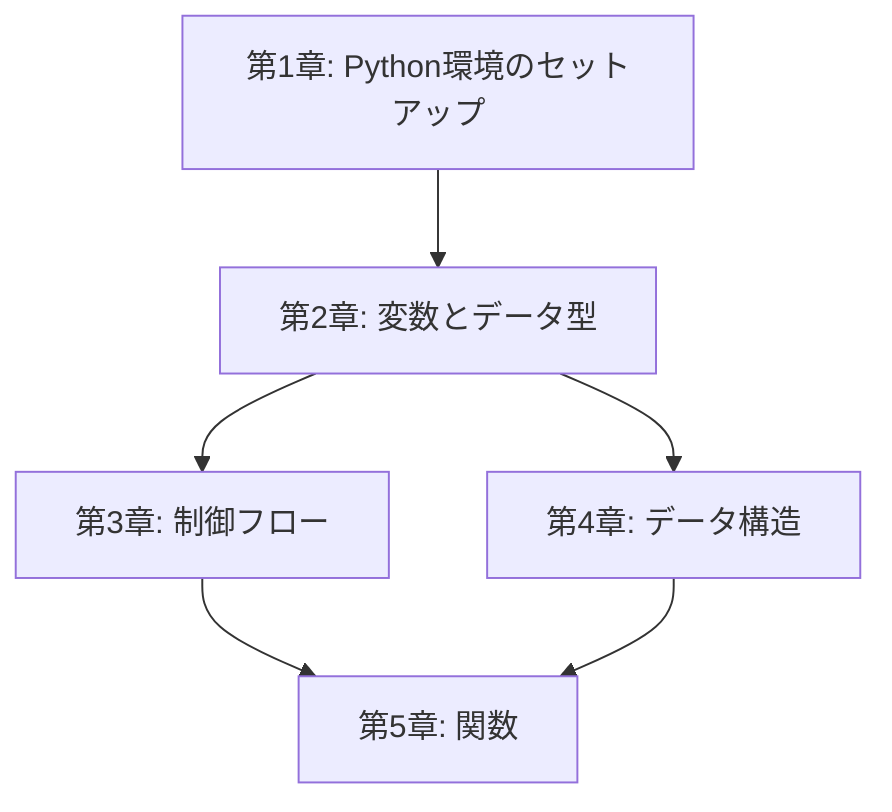

# 書籍構成・章間依存関係 (Book Architecture)

## 章間依存関係図

## 依存関係の説明

| 章 | 前提となる章 | 理由 |
|----|------------|------|
| 第1章 | なし | 環境構築のみ、前提知識不要 |
| 第2章 | 第1章 | Python実行環境が必要 |
| 第3章 | 第2章 | 変数・データ型を条件式やループで使用 |
| 第4章 | 第2章 | データ型の理解がリスト・辞書の前提 |
| 第5章 | 第3章, 第4章 | 制御フローとデータ構造を関数内で活用 |

## 読者の学習パス

唯一の推奨パス: **第1章 → 第2章 → 第3章 → 第4章 → 第5章**

20ページのコンパクトな構成のため、全章を順番に読み進めることを前提とする。
