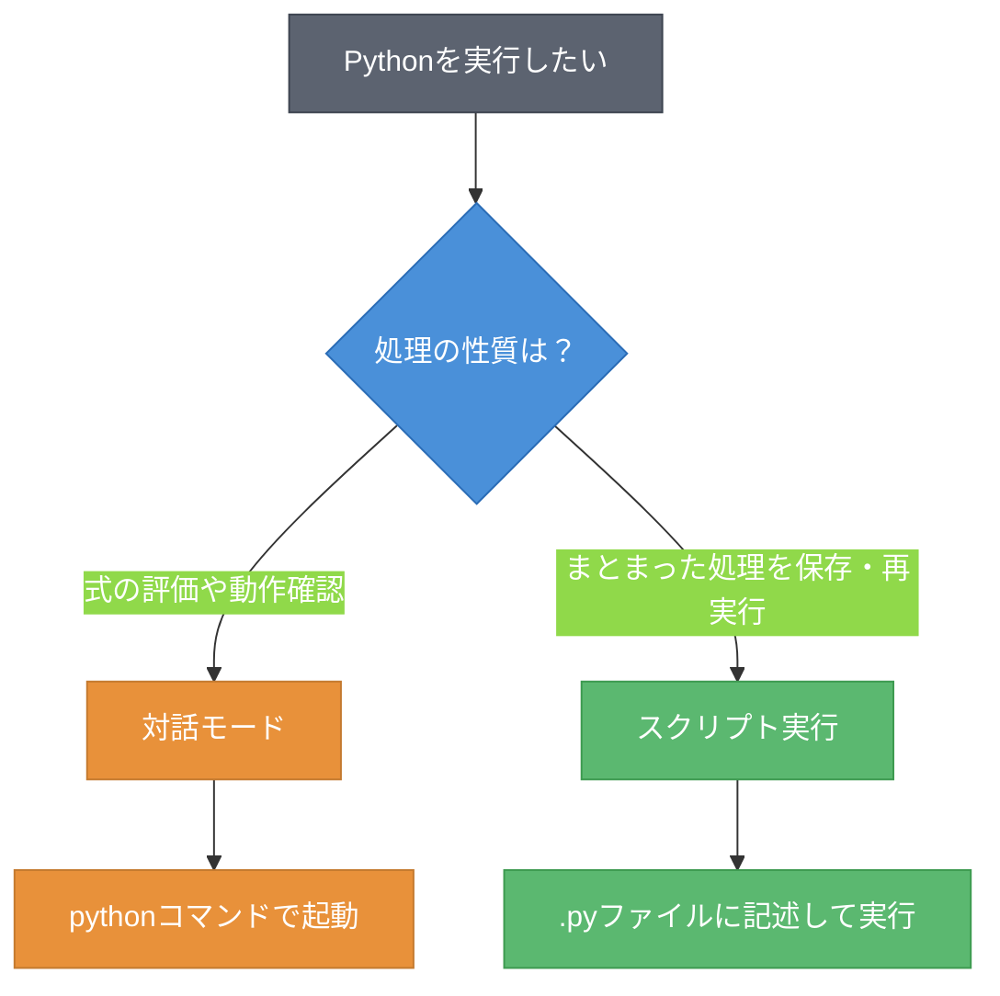
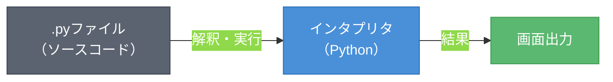

# 第1章 Python環境のセットアップ ― Pythonを動かす準備

本書は、Pythonの基礎を20ページで習得することを目指す。変数、制御フロー、データ構造、関数といった基本要素を、サンプルコードを実行しながら学んでいく。まずはPythonを動かすための環境を整えるところから始める。

## 1.1 Pythonのインストール

Pythonを使うには、まず実行環境をPCにインストールする必要がある。Python公式サイトからインストーラをダウンロードし、セットアップを行う。表1.1にOS別のインストール方法を示す。

**表1.1: OS別インストール方法**

| OS | インストール方法 | 備考 |
|----|----------------|------|
| Windows | 公式サイトからインストーラをダウンロードして実行 | 「Add Python to PATH」にチェックを入れる |
| macOS | 公式サイトからインストーラをダウンロードして実行 | Xcode Command Line Tools導入済みならpython3が利用可能な場合がある |
| Linux | パッケージマネージャを使用（`apt install python3`等） | ディストリビューションにより標準搭載 |

インストールが完了したら、コマンドライン（Command Line）を開いて以下のコマンドを実行する。

```shell
# Pythonのバージョンを確認する
python --version
```

`Python 3.x.x`のように表示されれば、インストールは成功である（3.12以上を推奨）。環境によっては`python`ではなく`python3`と入力する必要がある。

## 1.2 対話モードとスクリプト実行

Pythonには二つの実行方法がある。対話モード（Interactive Mode）とスクリプト（Script）実行である。図1.1に、それぞれの使い分けの基準を示す。



**図1.1: 対話モードとスクリプト実行の使い分け**

### 対話モード

対話モードは、REPL（Read-Eval-Print Loop）とも呼ばれる。コマンドラインで`python`と入力すると起動する。

```python
# 対話モードでの実行例
>>> 1 + 2
3
>>> "Hello" + " " + "Python"
'Hello Python'
```

`>>>`はPythonが入力を待っている状態を示すプロンプトである。式を入力すると、即座に結果が表示される。試行錯誤しながら動作を確認するのに適している。対話モードを終了するには`exit()`と入力する。

### スクリプト実行

まとまった処理を保存して繰り返し実行する場合は、スクリプトファイルを使う。テキストエディタで`.py`拡張子のファイルを作成し、コードを記述する。

```python
# hello.py
# 挨拶を表示するスクリプト
print("Hello, Python!")
print("Welcome to programming!")
```

このファイルを実行するには、コマンドラインで以下を入力する。

```shell
# スクリプトを実行する
python hello.py
```

対話モードが1行ずつ実行するのに対し、スクリプト実行はファイル内のコードを上から順に処理する。

## 1.3 最初のプログラム

ここでは`print()`関数（Function）を使い、画面に文字を出力するプログラムを書く。図1.2に、プログラムが実行される流れを示す。



**図1.2: プログラムの実行フロー**

ソースコードをインタプリタ（Interpreter）が1行ずつ読み取り、解釈して実行する。`print()`関数は、括弧内に指定した値を画面に出力する。

```python
# first_program.py
# 画面に文字列を出力する
print("Hello, World!")
print("Python is fun!")
print("1 + 2 =", 1 + 2)
```

実行結果は以下のとおりである。

```
Hello, World!
Python is fun!
1 + 2 = 3
```

3行目のように、`print()`にはカンマで区切って複数の値を渡せる。文字列と計算結果を組み合わせて出力できる。プログラムは上から順に実行されるため、出力も記述した順番で表示される。

---

本章では、Pythonのインストールと二つの実行方法を学んだ。対話モードとスクリプト実行を使い分け、`print()`関数で画面に文字列を出力した。ここまでは固定の文字列を扱っただけである。次の第2章では、値を変数に格納して柔軟に操作する方法を学ぶ。

---

## 理解度チェック

### Q1. 対話モードとスクリプト実行の違い

**種類**: 概念の確認

**難易度**: 基礎

**問題文**:
Pythonの対話モードとスクリプト実行の違いを説明し、それぞれどのような場面で使うのが適切か述べよ。

<details>
<summary>解答と解説</summary>

**解答**: 対話モードは1行ずつコードを入力して即座に結果を確認できる実行方法であり、式の評価や動作確認に適している。スクリプト実行は`.py`ファイルにコードを記述して一括実行する方法であり、まとまった処理を保存して繰り返し実行する場面に適している。

**解説**: 対話モードはREPL（Read-Eval-Print Loop）とも呼ばれ、入力→評価→出力のサイクルを繰り返す。短い式の検証や学習中の試行錯誤に向いている。一方、スクリプト実行はファイルに保存したコードを上から順に処理するため、再利用性が高い。

**関連する節**: 1.2節

</details>

---

### Q2. 実行方法の選択

**種類**: 判断問題

**難易度**: 基礎

**問題文**:
以下の場面では、対話モードとスクリプト実行のどちらが適切か。

1. `100 * 365`の計算結果を確認したい
2. 10行のプログラムを書いて、明日も同じ処理を実行したい
3. ある関数の戻り値を手早く確認したい

**選択肢**:
- (a) 1: 対話モード、2: スクリプト実行、3: 対話モード
- (b) 1: スクリプト実行、2: スクリプト実行、3: 対話モード
- (c) 1: 対話モード、2: 対話モード、3: スクリプト実行
- (d) 1: スクリプト実行、2: 対話モード、3: スクリプト実行

<details>
<summary>解答と解説</summary>

**解答**: (a)

**解説**: 場面1は単発の計算であり、対話モードが適している。場面2はコードを保存して再実行する必要があるため、スクリプト実行が適切である。場面3は動作確認であり、対話モードで即座に結果を確認するのが効率的である。

**関連する節**: 1.2節

</details>

---

### Q3. print()関数の役割

**種類**: 概念の確認

**難易度**: 基礎

**問題文**:
以下のコードを実行した場合、出力はどうなるか。

```python
print("A")
print("B", "C")
print(1 + 2)
```

<details>
<summary>解答と解説</summary>

**解答**:
```
A
B C
3
```

**解説**: `print()`関数は括弧内の値を画面に出力する。カンマで区切って複数の値を渡すと、スペースで区切って出力される。`1 + 2`のような式は評価されてから出力される。各`print()`の出力は改行で区切られる。

**関連する節**: 1.3節

</details>
