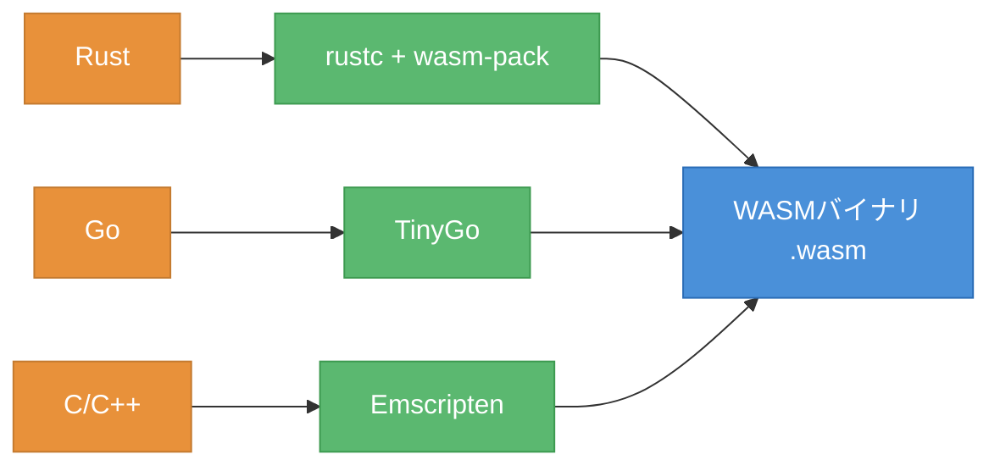
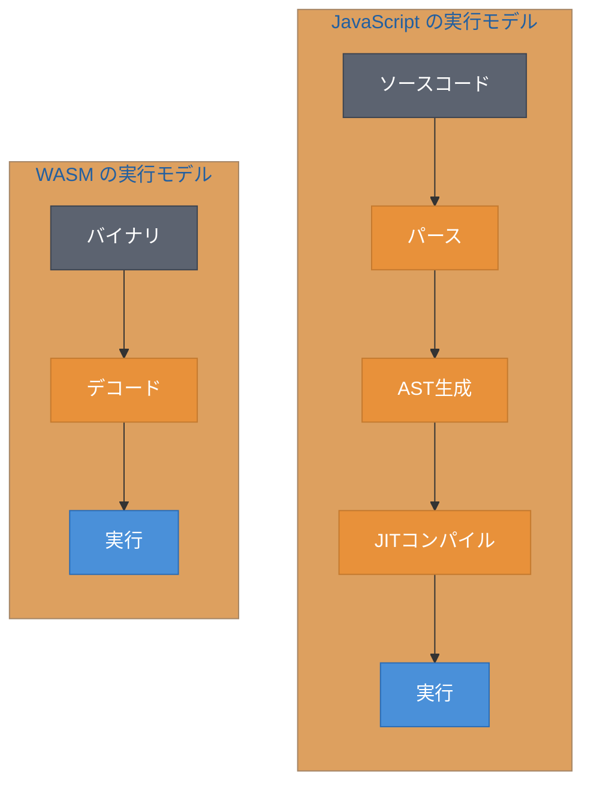
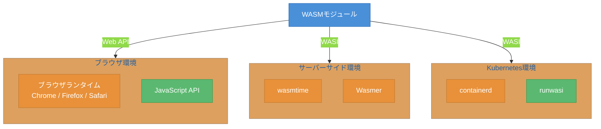

# 第1章 WASMとは何か ― バイナリフォーマットの本質

WebAssembly（WASM）という名前を聞いたことがあるだろうか。「Webブラウザで動くアセンブリ言語」という印象を持つ人も多い。しかし、その理解は正確ではない。WASMは特定のプログラミング言語ではなく、複数の言語からコンパイル可能なポータブルなバイナリフォーマットである。

本章では、WASMの本質を明らかにし、なぜ今この技術が注目されているのかを解説する。WASMがJavaScriptを補完する存在であること、そしてブラウザを超えてサーバーサイドやKubernetesにまで活用が広がっていることを理解する。

## 1.1 WebAssemblyの正体 ― バイナリフォーマットとしてのWASM

WASMを理解する第一歩は、「WASMは言語ではない」という事実を認識することである。WASMはコンパイルターゲット（Compile Target）、すなわちソースコードが変換される先のバイナリフォーマット（Binary Format）である。

図1.1に、ソースコードからWASMバイナリへの変換フローを示す。



図1.1: WASMの位置づけ ― ソースコードからバイナリまでの変換フロー

Rust、Go、C/C++といった複数の言語から、それぞれのコンパイラを通じて同一の`.wasm`ファイルが生成される。この仕組みは、Javaのバイトコード（Bytecode）やLLVM IR（Intermediate Representation）と似た構造である。Javaが「Write once, run anywhere」を実現するためにJVMバイトコードを使うように、WASMもポータブルなバイトコードとして機能する。

WASMにはテキスト表現形式であるWAT（WebAssembly Text Format）も存在する。以下はWATの最小例である。

```wat
;; 二つの整数を加算するWASMモジュール（WAT形式）
(module
    (func $add (param $a i32) (param $b i32) (result i32)
        local.get $a
        local.get $b
        i32.add
    )
    (export "add" (func $add))
)
```

コード1.1: WASMテキスト形式（WAT）の最小例

このWATは人間が読める形式であるが、実際に配布・実行されるのはバイナリ形式の`.wasm`ファイルである。WASMモジュール（WASM Module）とは、この`.wasm`ファイルとしてコンパイルされた実行可能な単位を指す。

## 1.2 なぜWASMか ― JavaScriptの限界とWASMの強み

WASMが生まれた背景には、JavaScriptの性能的な限界がある。JavaScriptは動的型付け言語であり、実行時に型チェックやガベージコレクション（Garbage Collection）が発生する。ブラウザはJITコンパイル（Just-in-Time Compilation）で高速化を図るが、それでもネイティブコードの速度には及ばない。

図1.2に、JavaScriptとWASMの実行モデルの違いを示す。



図1.2: JavaScript vs WASM ― 実行モデルの比較

JavaScriptはソースコードのパース、AST（Abstract Syntax Tree）生成、JITコンパイルという複数段階を経て実行される。一方WASMは、事前にコンパイル済みのバイナリをデコードするだけで実行に移れる。この差がWASMの起動速度と実行速度の優位性を生む。

表1.1に、JavaScriptとWASMの特性を比較する。

| 特性 | JavaScript | WASM |
|------|-----------|------|
| 型システム | 動的型付け | 静的型付け（i32, i64, f32, f64） |
| 実行速度 | JITコンパイルで最適化 | ネイティブに近い速度 |
| 起動速度 | パース・コンパイルが必要 | デコードのみで高速 |
| メモリ管理 | ガベージコレクション | 線形メモリ（Linear Memory、手動管理） |
| セキュリティ | 同一オリジンポリシー | サンドボックス（Sandbox）実行 |
| DOM操作 | 直接可能 | JavaScript経由で間接的に操作 |

表1.1: JavaScriptとWASMの特性比較

重要な点は、WASMはJavaScriptの代替ではなく補完であるということである。DOM操作やイベントハンドリングはJavaScriptが得意とする領域であり、WASMが直接DOMを操作することはできない。WASMが強みを発揮するのは、CPU集約的な計算処理やバイナリデータの操作といった領域である。

WASMはサンドボックス内で実行される。ホスト環境のファイルシステムやネットワークに直接アクセスすることはできず、ホストから明示的にインポートされた関数を通じてのみ外部とやり取りする。この設計がセキュリティ上の安全性を保証する。

## 1.3 ブラウザを超えて ― WASIとサーバーサイドWASM

WASMは当初ブラウザ向けに設計されたが、2019年にWASI（WebAssembly System Interface）が提案され、状況が大きく変わった[^2]。WASIは、WASMモジュールがファイルシステムやネットワーク等のOS機能にアクセスするための標準インターフェースである。

図1.3に、WASMの実行環境の広がりを示す。



図1.3: WASMの実行環境 ― ブラウザからサーバーサイドまで

WASIの登場により、WASMはブラウザ、CLI、サーバーサイド、そしてKubernetesまで、あらゆる環境で動作するポータブルなバイナリフォーマットとなった。Bytecode Allianceがこの標準化を推進しており、同団体のwasmtimeをはじめ、Wasmer等のランタイムが開発されている。

Docker創業者のSolomon Hykes氏は2019年に以下のようにツイートした[^1]。「WASMとWASIが2008年に存在していたら、Dockerを作る必要はなかっただろう」。この発言はWASMの可能性を端的に表している。WASMモジュールはコンテナイメージよりも軽量で、起動時間はマイクロ秒からミリ秒単位である[^3]。Kubernetes環境では、containerdとrunwasiを組み合わせることで、WASMワークロードをPodとして実行できる。

ただし、WASMがコンテナを完全に置き換えるわけではない。既存のエコシステムとの互換性、デバッグツールの成熟度、チームの学習コスト等を考慮した上で、適切な技術を選択する必要がある。本書では第5章で、KubernetesでのWASMデプロイを実践する。

本章ではWASMの本質を概念として理解した。WASMは言語ではなくポータブルなバイトコードであり、JavaScriptを補完する存在として設計された。WASIの登場によりブラウザを超えた活用が可能になり、サーバーサイドやKubernetesでの実行も現実的になっている。次の第2章では、実際にRustとwasm-packを使ってWASMモジュールを作成し、最小実装を通じてこの技術を体感する。

[^1]: Solomon Hykes, Twitter（現X）, 2019年3月27日. https://x.com/solomonstre/status/1111004913222324225
[^2]: Lin Clark, "Standardizing WASI: A system interface to run WebAssembly outside the web", Mozilla Hacks, 2019年3月. https://hacks.mozilla.org/2019/03/standardizing-wasi-a-webassembly-system-interface/
[^3]: Wasmtime公式サイトでは、WASMインスタンスの起動時間を5マイクロ秒と報告している. https://wasmtime.dev/

## 参考文献

- WebAssembly公式仕様, https://webassembly.org/
- WASI公式リポジトリ, https://github.com/WebAssembly/WASI
- Bytecode Alliance, https://bytecodealliance.org/
- containerd/runwasi, https://github.com/containerd/runwasi

## 理解度チェック

### Q1. WASMの本質

**種類**: 概念の確認

**難易度**: 基礎

**問題文**:
WebAssembly（WASM）が「プログラミング言語」ではなく「バイナリフォーマット」であるとは、具体的にどういう意味か。JavaバイトコードやLLVM IRとの共通点を含めて説明せよ。

<details>
<summary>解答と解説</summary>

**解答**: WASMは特定のプログラミング言語ではなく、Rust、Go、C/C++等の複数の言語からコンパイルされる先のバイナリ形式である。Javaバイトコードが複数の言語（Java、Kotlin、Scala等）からコンパイルされ、JVM上で動作するのと同様に、WASMバイナリも複数の言語から生成され、ブラウザやwasmtime等のランタイム上で動作する。

**解説**: WASMは「コンパイルターゲット」として設計されており、特定の言語に縛られない。この設計により、既存の言語エコシステム（Rustのクレート等）をWASM上で再利用できるという大きな利点がある。

**関連する節**: 1.1節

</details>

---

### Q2. WASMの適用判断

**種類**: 判断問題

**難易度**: 応用

**問題文**:
以下のWebアプリケーション機能のうち、JavaScriptではなくWASMで実装することで最も大きなメリットが得られるものはどれか。

**選択肢**:
- (a) フォーム入力のバリデーション
- (b) 大量の数値データに対する統計計算
- (c) ボタンクリック時のUI更新
- (d) REST APIからのデータ取得と表示

<details>
<summary>解答と解説</summary>

**解答**: (b)

**解説**: WASMはCPU集約的な処理で最も優位性を発揮する。大量の数値データの統計計算はまさにこのカテゴリに該当する。一方、(a)のフォームバリデーション、(c)のUI更新、(d)のAPI通信はJavaScriptが得意とする領域であり、WASMを導入するメリットは小さい。特にDOM操作はWASMから直接行えないため、(c)をWASMで実装するのは不適切である。

**関連する節**: 1.2節

</details>

---

### Q3. WASIの役割

**種類**: 概念の確認

**難易度**: 基礎

**問題文**:
WASI（WebAssembly System Interface）はどのような課題を解決するために設計されたか。WASIが存在しない場合のWASMの制約と合わせて説明せよ。

<details>
<summary>解答と解説</summary>

**解答**: WASMは本来サンドボックス内で実行され、ファイルシステムやネットワーク等のOS機能に直接アクセスできない。WASIは、これらのOS機能へのアクセスを標準化されたインターフェースとして提供することで、WASMをブラウザ外（CLI、サーバーサイド、Kubernetes等）でも実行可能にした。WASIがなければ、WASMはブラウザ内での計算処理にしか使えない。

**解説**: WASIにより、WASMは「ブラウザ用の技術」から「ポータブルなバイトコード」へと進化した。wasmtimeやWasmerといったランタイムがWASIを実装しており、コマンドラインツールやサーバーアプリケーションとしてWASMを実行できる。

**関連する節**: 1.3節

</details>
