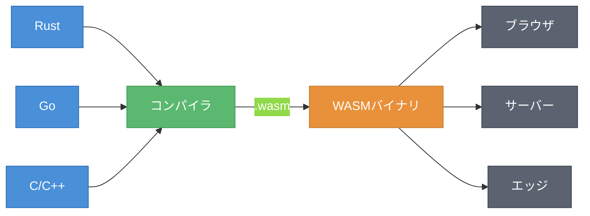
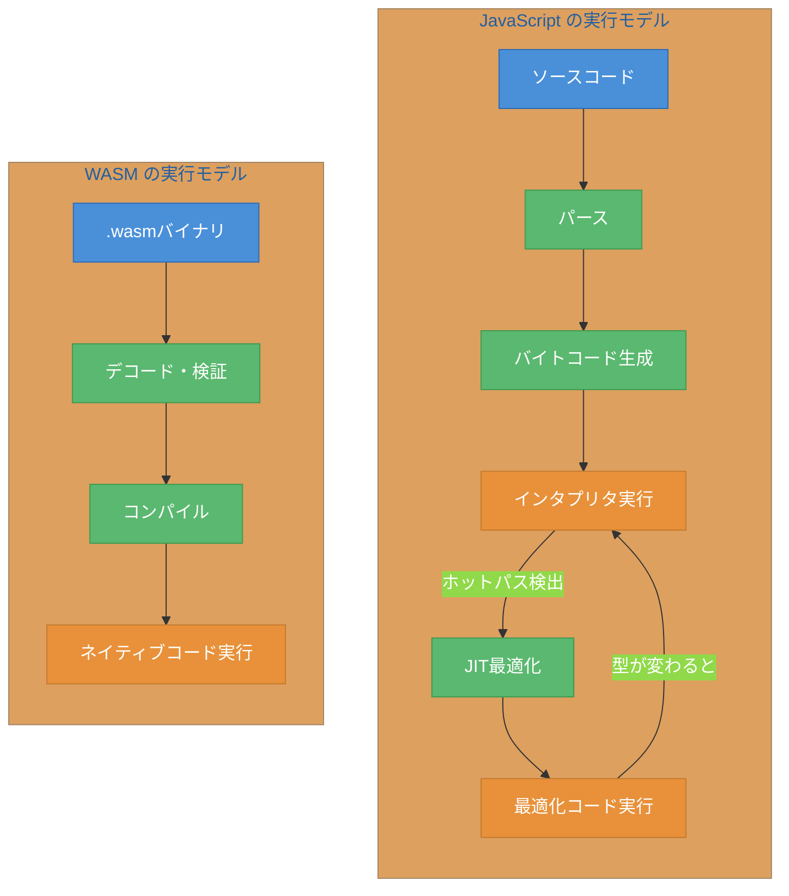
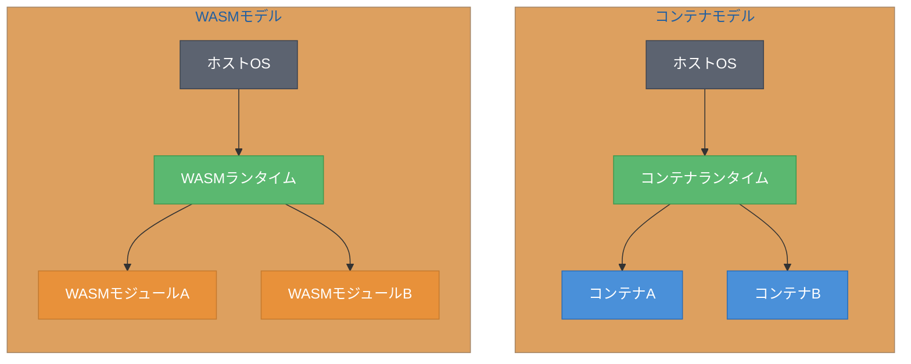

# 第1章 WASMの正体 ― ポータブルなバイトコード

WebAssembly（WASM）という名前を聞いて、新しいプログラミング言語を思い浮かべる読者もいるかもしれない。しかし、WASMの本質はそこにはない。WASMは「ポータブルなバイトコード（Bytecode）」、つまり複数のプラットフォームで動作するバイナリ命令フォーマットである。

本章では、WASMがどのような仕組みで動作し、なぜ注目されているのかを解説する。ブラウザ上のJavaScriptの限界から始まり、WASI（WebAssembly System Interface）によるブラウザ外への展開、さらにはKubernetes上での活用まで、WASMの全体像を把握する。

---

## 1.1 WASMとは何か

WASMは、2017年に主要ブラウザ（Chrome、Firefox、Safari、Edge）で実装されたバイナリ命令フォーマットである[^1]。重要なのは、WASM自体はプログラミング言語ではないという点である。Rust、Go、C/C++といった既存の言語からコンパイルされた結果として生成されるバイナリが、WASMである。

図1.1に、WASMの位置づけを示す。

**図1.1: WASMの位置づけ ― 複数言語からコンパイルされ、複数環境で実行される**

図1.1が示すように、WASMは「コンパイルターゲット」としての役割を持つ。ソースコードがどの言語で書かれているかに関係なく、コンパイラを通じて同一のバイナリフォーマット（`.wasm`ファイル）が生成される。生成されたバイナリは、ブラウザ、サーバー、エッジデバイスなど、WASMランタイムが存在する環境であればどこでも動作する。

WASMモジュール（WASM Module）はスタックベースの仮想マシン上で実行される。モジュールは関数、線形メモリ（Linear Memory）、テーブル、グローバル変数をエクスポート・インポートできる。線形メモリは連続したバイト配列であり、外部からはArrayBufferとしてアクセスされる。このモジュール構造により、WASMは他のコードと安全に連携できるサンドボックス実行環境を実現している。

---

## 1.2 なぜWASMか ― JavaScriptの限界

JavaScriptはWebの標準言語として進化を続けてきた。V8をはじめとするJavaScriptエンジンはJIT（Just-In-Time）コンパイルにより高速化されているが、構造的な制約が存在する。

図1.2に、JavaScriptとWASMの実行モデルの違いを示す。

**図1.2: JavaScript vs WASMの実行モデル ― JITの動的最適化とWASMの直線的な実行**

JavaScriptは動的型付け言語であるため、エンジンは実行時に型を推定し、JITコンパイルで最適化する。しかし、型が変化すると最適化が無効になり（脱最適化）、再度インタプリタに戻る。この繰り返しがパフォーマンスの予測を困難にする。

一方、WASMはコンパイル済みのバイナリであり、AOT（Ahead-Of-Time）コンパイルに近い実行モデルを持つ。型情報は事前に確定しており、デコード・検証後にネイティブコードへ直接コンパイルされる。脱最適化は発生しない。この「予測可能なパフォーマンス」がWASMの最大の強みである。

特にCPU集約的な処理 ― 画像処理、暗号演算、物理シミュレーション等 ― では、WASMはJavaScriptに対して大幅な性能優位を示す。第4章でサンプルアプリを題材にこの性能差を定量的に検証する。

---

## 1.3 ブラウザの外へ ― WASIとKubernetes

WASMの活用範囲はブラウザにとどまらない。2019年にMozillaのLin Clarkらが提案したWASI（WebAssembly System Interface）により、WASMモジュールはファイルシステムやネットワーク等のOS機能にアクセスできるようになった[^2]。同年11月に設立されたBytecode Allianceが、WASIを含むWASMエコシステムの標準化を推進している。

図1.3に、コンテナとWASMの実行モデルを比較する。

**図1.3: コンテナ vs WASMの実行モデル ― WASMはより軽量なレイヤーで動作する**

コンテナはOSレベルの分離を行うため、ファイルシステムやネットワーク名前空間の構築にオーバーヘッドが生じる。WASMモジュールはバイトコードレベルのサンドボックスで動作するため、起動が高速でメモリ消費も少ない。

表1.1に両者の特性を比較する[^3]。

**表1.1: コンテナとWASMの特性比較**

| 特性 | コンテナ | WASM |
|------|---------|------|
| 起動時間 | 数百ミリ秒〜数秒 | 数ミリ秒 |
| バイナリサイズ | 数十MB〜数百MB | 数十KB〜数MB |
| セキュリティモデル | OS名前空間分離 | サンドボックス（Capability-based） |
| ポータビリティ | OS/アーキテクチャ依存 | 完全にポータブル |
| エコシステム成熟度 | 成熟 | 発展途上 |

Kubernetes上でのWASM実行は、containerd + runwasi（WASMシム）により実現される。runwasiはcontainerdのシムとしてWASMランタイム（wasmtime等）を呼び出し、コンテナの代わりにWASMモジュールを実行する。第5章でこの構成を使ったデプロイを実践する。

WASMがコンテナを完全に置き換えるわけではない。既存のエコシステムとの互換性、デバッグツールの充実度、ネットワーキング機能の制約など、コンテナが優位な領域は依然として存在する。重要なのは、ユースケースに応じて適切な技術を選択することである。

---

## 1.4 本書で作るもの

本書では、画像フィルタWebアプリケーション「WASM Image Filter」を段階的に構築しながらWASMを学ぶ。このアプリは、ブラウザ上で画像にフィルタ（グレースケール、セピア、ぼかし等）を適用する。画像処理ロジックをRustでWASMモジュールとして実装し、JavaScriptのUIから呼び出す構成である。

図1.4に、各章でのサンプルアプリの構築ステップを示す。

**図1.4: サンプルアプリの構築ステップ ― 各章で機能を段階的に追加する**

第2章ではRust + wasm-packで最小限のWASMモジュール（グレースケール変換）を作成し、ブラウザで動作させる。第3章ではJavaScriptとの連携を深め、セピアやぼかしフィルタを追加する。第4章ではWASMとJavaScriptの性能を定量的に比較し、バッチ処理機能を実装する。第5章ではバンドルサイズの最適化を行い、Kubernetes上にデプロイする。

概念を理解したところで、次章では実際にRustでWASMモジュールを作成し、最小限のコードでWASMの動作原理を体験する。

---

## 理解度チェック

### Q1. WASMの本質

**種類**: 概念の確認

**難易度**: 基礎

**問題文**:
WebAssembly（WASM）が「プログラミング言語」ではなく「バイナリフォーマット」であるとは、具体的に何を意味するか。

解答と解説

**解答**: WASMは、Rust・Go・C/C++等の既存言語からコンパイルされて生成されるバイナリ命令フォーマットである。WASM自体で直接プログラムを記述するのではなく、他の言語のコンパイルターゲットとして機能する。

**解説**: 図1.1に示した通り、WASMは複数の言語からコンパイル可能な共通のバイナリフォーマットである。これにより、開発者は使い慣れた言語でコードを書き、WASMとして配布できる。

**関連する節**: 1.1節

---

### Q2. WASMの適用判断

**種類**: 判断問題

**難易度**: 応用

**問題文**:
以下のユースケースのうち、WASMの導入が最も効果的なものはどれか。

**選択肢**:
- (a) ブログ記事の表示・レンダリング
- (b) 大量のセンサーデータのリアルタイム集計処理
- (c) ユーザー入力フォームのバリデーション
- (d) REST APIからのデータ取得と一覧表示

解答と解説

**解答**: (b)

**解説**: WASMはCPU集約的な処理で最大の効果を発揮する。(b)の大量データのリアルタイム集計は計算量が多く、WASMの予測可能な高パフォーマンスが活きるユースケースである。(a)(c)(d)はDOM操作やI/Oが中心であり、JavaScriptで十分対応できる。

**関連する節**: 1.2節

---

### Q3. コンテナとWASMの使い分け

**種類**: 判断問題

**難易度**: 応用

**問題文**:
マイクロサービスの一部をWASMに移行するか検討している。以下のうち、WASMへの移行に最も適しているのはどれか。

**選択肢**:
- (a) PostgreSQLに接続し、複雑なクエリを実行するデータアクセス層
- (b) 画像のサムネイル生成を行うステートレスな処理サービス
- (c) WebSocketを使ったリアルタイムチャットサーバー
- (d) 複数の外部APIを呼び出してデータを集約するBFFサービス

解答と解説

**解答**: (b)

**解説**: 表1.1に示した通り、WASMは起動が高速でポータビリティが高い反面、ネットワーキングやデータベース接続のエコシステムはまだ発展途上である。(b)の画像処理はCPU集約的でステートレスなため、WASMの強み（高速起動、軽量バイナリ、サンドボックスセキュリティ）を最大限に活かせる。(a)(c)(d)はネットワークI/Oや外部接続が中心であり、現時点ではコンテナの方が適している。

**関連する節**: 1.3節

---

## 参考文献

[^1]: "WebAssembly support now shipping in all major browsers" (2017), Mozilla Blog. https://blog.mozilla.org/en/mozilla/webassembly-in-browsers/
[^2]: Lin Clark "Standardizing WASI: A system interface to run WebAssembly outside the web" (2019), Mozilla Hacks. https://hacks.mozilla.org/2019/03/standardizing-wasi-a-webassembly-system-interface/
[^3]: Nicola Ballotta "WebAssembly on Kubernetes: the practice guide" (2024), CNCF Blog. https://www.cncf.io/blog/2024/03/28/webassembly-on-kubernetes-the-practice-guide-part-02/
