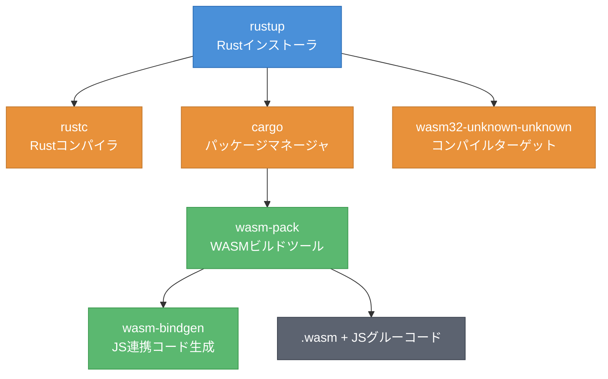
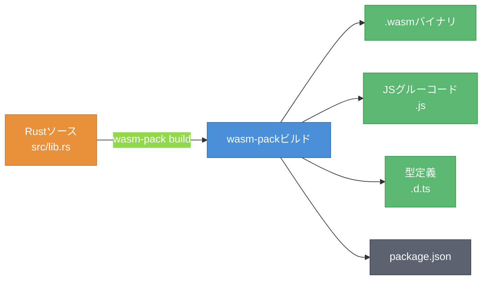

# 第2章 最小実装から理解する ― Rust + wasm-pack

第1章では、WASMがポータブルなバイトコードであり、複数の言語からコンパイル可能なバイナリフォーマットであることを理解した。本章では、実際にRustとwasm-packを使ってWASMモジュールを作成し、ブラウザ上で動作させるまでの一連の流れを体験する。

ツールチェーンの役割を理解した上で、wasm-bindgenによるRust-JavaScript間の型変換の仕組みを学ぶ。最後に、TinyGoやPyodideとの比較を通じて、言語選択の指針を示す。

## 2.1 開発環境の準備

WASMモジュールをRustで開発するには、いくつかのツールが必要である。図2.1に、WASM開発環境を構成するツールチェーンの全体像を示す。



図2.1: WASM開発環境の構成 ― ツールチェーンの全体像

各ツールの役割は以下の通りである。

- **rustup**: Rustツールチェーンのインストーラ。コンパイラやパッケージマネージャを管理する
- **cargo**: Rustのパッケージマネージャ兼ビルドツール。プロジェクト作成や依存関係管理を行う
- **wasm-pack**: Rustコードをwasm-bindgenを用いてWASMにビルドし、npmパッケージとして配布可能な形式に変換するツール

開発環境のセットアップ手順を以下に示す。

```bash
# Rustのインストール
curl --proto '=https' --tlsv1.2 -sSf https://sh.rustup.rs | sh

# WASMコンパイルターゲットの追加
rustup target add wasm32-unknown-unknown

# wasm-packのインストール
cargo install wasm-pack
```

`wasm32-unknown-unknown`は、WASMバイナリを生成するためのコンパイルターゲットである。「unknown-unknown」はOSとABIを問わないことを示しており、WASMのポータブル性を反映している。

## 2.2 Hello, WASM! ― 最初のWASMモジュール

環境が整ったところで、最初のWASMモジュールを作成する。cargoでプロジェクトを作成し、wasm-packでビルドする流れを図2.2に示す。



図2.2: wasm-packのビルドフロー ― RustソースからWASMモジュールまで

まず、cargoでライブラリプロジェクトを作成する。

```bash
# プロジェクト作成
cargo new --lib hello-wasm
cd hello-wasm
```

`Cargo.toml`にwasm-bindgenの依存関係を追加する。`crate-type`を`cdylib`に設定することで、動的ライブラリとしてWASMバイナリを生成する。

```toml
# Cargo.toml
[package]
name = "hello-wasm"
version = "0.1.0"
edition = "2021"

[lib]
crate-type = ["cdylib"]

[dependencies]
wasm-bindgen = "0.2"
```

次に、`src/lib.rs`にWASMモジュールとしてエクスポートする関数を実装する。

```rust
// src/lib.rs - Hello WASMモジュール
use wasm_bindgen::prelude::*;

// #[wasm_bindgen]アトリビュートにより、
// この関数がJavaScriptから呼び出し可能になる
#[wasm_bindgen]
pub fn greet(name: &str) -> String {
    format!("Hello, {}!", name)
}

#[wasm_bindgen]
pub fn add(a: i32, b: i32) -> i32 {
    a + b
}
```

コード2.1: Rust + wasm-bindgenによるHello WASM

`#[wasm_bindgen]`アトリビュートが鍵となる。このアトリビュートを関数に付与すると、wasm-bindgenが自動的にJavaScriptとの橋渡しコード、すなわちグルーコード（Glue Code）を生成する。

wasm-packでビルドを実行する。

```bash
# WASMモジュールのビルド
wasm-pack build --target web
```

ビルドが成功すると、`pkg/`ディレクトリに以下のファイルが生成される。

- `hello_wasm_bg.wasm`: コンパイル済みWASMバイナリ
- `hello_wasm.js`: JavaScriptグルーコード（WASMモジュールのロードと関数呼び出しを橋渡し）
- `hello_wasm.d.ts`: TypeScript型定義ファイル
- `package.json`: npmパッケージ定義

生成されたグルーコードを使い、ブラウザから呼び出す。

```html
<!-- index.html - ブラウザでのWASM実行 -->
<!DOCTYPE html>
<html>
<head><title>Hello WASM</title></head>
<body>
<script type="module">
    // グルーコードからinit関数とgreet関数をインポート
    import init, { greet, add } from './pkg/hello_wasm.js';

    async function main() {
        // WASMモジュールの初期化
        await init();

        // Rust関数の呼び出し
        console.log(greet("WebAssembly")); // "Hello, WebAssembly!"
        console.log(add(2, 3));            // 5
    }
    main();
</script>
</body>
</html>
```

コード2.2: 生成されたJSグルーコードの呼び出し

`init()`関数がWASMモジュールをロード・初期化し、その後は通常のJavaScript関数と同じように`greet()`や`add()`を呼び出せる。グルーコードが型変換やメモリ管理を隠蔽しているため、利用者側はWASMの内部動作を意識する必要がない。

## 2.3 wasm-bindgenの仕組み ― RustとJSの橋渡し

前節では`#[wasm_bindgen]`を使って関数をエクスポートした。ここでは、wasm-bindgenがRustとJavaScriptの型をどのように変換するかを詳しく見る。

表2.1に、Rust型とJavaScript型の対応を示す。

| Rust型 | JavaScript型 | 受け渡し方式 |
|--------|-------------|------------|
| `i32`, `u32` | `number` | 直接受け渡し |
| `i64`, `u64` | `BigInt` | 直接受け渡し |
| `f32`, `f64` | `number` | 直接受け渡し |
| `bool` | `boolean` | 直接受け渡し |
| `String` | `string` | 線形メモリ経由 |
| `&str` | `string` | 線形メモリ経由 |
| `Vec<u8>` | `Uint8Array` | 線形メモリ経由 |
| `JsValue` | 任意のJS値 | 参照テーブル経由 |

表2.1: Rust型とJavaScript型の対応表

プリミティブ型（`i32`、`f64`等）はWASMの値型と直接対応するため、変換コストなしで受け渡しできる。一方、`String`や`Vec<u8>`のような複合型は、WASMの線形メモリ上にデータを書き込み、ポインタとサイズをJavaScript側に渡す形式を取る。

文字列の受け渡し例を見る。

```rust
// src/lib.rs - 文字列操作の例
use wasm_bindgen::prelude::*;

#[wasm_bindgen]
pub fn reverse_string(input: &str) -> String {
    // Rust側で文字列を反転して返す
    // wasm-bindgenが線形メモリ経由の受け渡しを自動処理する
    input.chars().rev().collect()
}

#[wasm_bindgen]
pub fn count_chars(input: &str) -> usize {
    // 文字数を返す（usizeはi32/i64に変換される）
    input.chars().count()
}
```

コード2.3: 文字列の受け渡し例

`reverse_string`関数が呼ばれると、内部では以下の処理が行われる。

1. JavaScript側の文字列をUTF-8にエンコードし、WASMの線形メモリに書き込む
2. ポインタと長さをRust関数の引数として渡す
3. Rust関数が処理結果の文字列を線形メモリに書き込む
4. JavaScript側がポインタと長さを受け取り、文字列としてデコードする

この一連の処理はwasm-bindgenが生成するグルーコードにより自動化される。開発者が手動でメモリ操作を行う必要はない。

## 2.4 他言語との比較 ― TinyGo・Pyodide

RustはWASM開発で最も広く使われている言語である[^1]が、GoやPythonからもWASMを生成できる。ここでは、TinyGoとPyodideを紹介し、言語選択の指針を示す。

TinyGoによるWASMモジュールの例を示す。

```go
// main.go - TinyGoによるWASMモジュール
package main

import "syscall/js"

// JavaScript側にエクスポートする関数
func add(this js.Value, args []js.Value) interface{} {
    a := args[0].Int()
    b := args[1].Int()
    return a + b
}

func main() {
    // グローバルオブジェクトに関数を登録
    js.Global().Set("wasmAdd", js.FuncOf(add))

    // WASMモジュールを終了させない
    select {}
}
```

コード2.4: TinyGoによるWASMモジュール例

TinyGoでは`syscall/js`パッケージを使い、JavaScriptのグローバルオブジェクトに関数を登録する。Rustの`#[wasm_bindgen]`のような宣言的な記法ではなく、手続き的に関数を公開する点が異なる。

表2.2に、三つの言語のWASM対応を比較する。

| 項目 | Rust + wasm-pack | TinyGo | Pyodide |
|------|-----------------|--------|---------|
| バイナリサイズ（Hello World） | 約20-50KB | 約60-300KB | 約6-7MB（ランタイム含む） |
| ランタイム | 不要 | Go軽量ランタイム含む | CPythonランタイム含む |
| JS連携 | wasm-bindgen（自動） | syscall/js（手動） | Pyodide API |
| エコシステム | cargoクレート活用可 | 標準ライブラリの一部 | pip パッケージ一部対応 |
| 適用場面 | 高性能・小サイズ重視 | Go既存コードの移植 | Python既存コードの移植 |

表2.2: WASM対応言語の比較（Rust / TinyGo / Pyodide）

RustがWASM開発で広く選ばれている理由は二つある。第一に、ガベージコレクションの仕組みを持たないため、ランタイムをバイナリに含める必要がなく、サイズが小さい。第二に、cargoのエコシステムを通じて既存のクレートをWASMでも活用できる。

一方、TinyGoは既存のGoコードをWASMに移植する場合に有用である。Pyodideは、データ分析や機械学習等のPythonエコシステムをブラウザで活用したい場合に適している。ただし、Pyodideはバイナリサイズが大きく、起動にも数秒を要するため[^2]、パフォーマンスが重要な用途には向かない。

本章では、Rustとwasm-packによるWASMモジュールの作成から実行までを体験し、wasm-bindgenによる型変換の仕組みを理解した。プリミティブ型は直接受け渡し可能であるが、文字列やバイト列は線形メモリを介して受け渡される。次の第3章では、JavaScriptとの本格的な連携に進み、メモリ共有の仕組みや画像処理の実例を通じて実践的な開発パターンを学ぶ。

[^1]: Scott Logic "The State of WebAssembly 2023" 調査では、Rustが最も使用されているWASM開発言語として報告されている. https://blog.scottlogic.com/2023/10/18/the-state-of-webassembly-2023.html
[^2]: Pyodide公式ドキュメントによると、初期化に数秒を要する. https://pyodide.org/en/stable/usage/downloading-and-deploying.html

## 参考文献

- wasm-pack公式ドキュメント, https://rustwasm.github.io/wasm-pack/
- wasm-bindgenガイド, https://rustwasm.github.io/wasm-bindgen/
- Shrinking .wasm Size, https://rustwasm.github.io/book/game-of-life/code-size.html
- TinyGo WebAssemblyガイド, https://tinygo.org/docs/guides/webassembly/
- Pyodide公式ドキュメント, https://pyodide.org/

## 理解度チェック

### Q1. wasm-packの生成物

**種類**: 概念の確認

**難易度**: 基礎

**問題文**:
`wasm-pack build --target web`を実行した際に生成されるファイル群を4つ挙げ、それぞれの役割を説明せよ。

<details>
<summary>解答と解説</summary>

**解答**:
1. `.wasm`ファイル: コンパイル済みWASMバイナリ。ブラウザやランタイムが実行する
2. `.js`ファイル: JavaScriptグルーコード。WASMモジュールのロードと関数呼び出しの橋渡し
3. `.d.ts`ファイル: TypeScript型定義。エディタの補完やTypeScriptプロジェクトとの統合に使用
4. `package.json`: npmパッケージ定義。npmやwebpackとの統合に使用

**解説**: wasm-packは単なるコンパイラではなく、WASMモジュールをJavaScriptエコシステムに統合するためのツールである。生成されるグルーコードにより、WASMの内部動作を意識せずにJavaScriptから利用できる。

**関連する節**: 2.2節

</details>

---

### Q2. wasm-bindgenの型変換

**種類**: 概念の確認

**難易度**: 基礎

**問題文**:
Rustの`String`型をJavaScriptに返す際、内部でどのような処理が行われるか。プリミティブ型（`i32`等）の受け渡しとの違いを含めて説明せよ。

<details>
<summary>解答と解説</summary>

**解答**: プリミティブ型（`i32`、`f64`等）はWASMの値型と直接対応するため、変換コストなしで受け渡しできる。一方、`String`型は以下の手順で受け渡される。(1) Rust側が処理結果の文字列をWASMの線形メモリにUTF-8で書き込む。(2) ポインタと長さをJavaScript側に返す。(3) JavaScript側がポインタと長さを使って線形メモリから文字列を読み取り、JavaScriptの文字列にデコードする。この処理はwasm-bindgenのグルーコードが自動で行う。

**解説**: WASMの関数は数値型しか直接やり取りできないため、文字列やバイト列は線形メモリを介した間接的な受け渡しが必要になる。wasm-bindgenはこの複雑さを隠蔽する。

**関連する節**: 2.3節

</details>

---

### Q3. 言語選択の判断

**種類**: 判断問題

**難易度**: 応用

**問題文**:
以下のプロジェクトにWASMを導入する場合、Rust、TinyGo、Pyodideのどれを選択すべきか。理由と共に答えよ。

「ブラウザ上で動作する画像編集ツールを開発している。画像のリサイズやフィルタ処理をWASMで高速化したい。バイナリサイズはできるだけ小さく保ちたい。」

<details>
<summary>解答と解説</summary>

**解答**: Rust + wasm-packを選択すべきである。

理由:
1. 画像処理はCPU集約的な処理であり、WASMの性能優位性が最も発揮される領域である
2. Rustはガベージコレクタを持たないため、バイナリサイズが最小（約20-50KB）に抑えられる。バイナリサイズの要件を満たす
3. imageクレート等、Rustには画像処理用のエコシステムが充実しており、WASMでも活用可能である

TinyGoは約60-300KBとサイズが大きく、Pyodideはランタイムだけで約6-7MBに達するため、サイズ要件を満たせない。

**解説**: 高性能かつ小サイズが求められるWASMプロジェクトでは、Rustが最適な選択肢である。

**関連する節**: 2.4節

</details>

---

### Q4. WASM導入の設計判断

**種類**: 設計問題

**難易度**: 応用

**問題文**:
既存のNode.js製Webアプリケーションに、CSVファイルの集計処理をWASMで高速化する機能を追加することになった。以下の点を考慮して、導入方針を設計せよ。

1. どの部分をWASMで実装し、どの部分をJavaScriptに残すか
2. Rustモジュール側で受け取るべきデータ形式は何か
3. 導入にあたってのリスクと対策

<details>
<summary>解答と解説</summary>

**解答**:

1. **WASM側**: CSVデータのパース・集計計算（合計、平均、フィルタリング等のCPU集約処理）。**JavaScript側**: ファイルのアップロードUI、結果の画面表示、ユーザー操作のイベントハンドリング

2. Rustモジュールには`&[u8]`（バイト列）としてCSVデータを渡す。JavaScriptの`File`APIで読み取ったデータを`Uint8Array`に変換し、wasm-bindgen経由で線形メモリに転送する。集計結果はJSON文字列として`String`で返す

3. リスク: (a) 大きなCSVファイルでの線形メモリ不足 → メモリの動的拡張（`wasm32`では最大4GB）の範囲内で処理するか、チャンク分割で対応。(b) チームのRust学習コスト → wasm-bindgenの型変換に限定し、複雑なRustパターンは避ける

**解説**: WASMの導入は「CPU集約処理の高速化」に焦点を絞り、UIやI/O処理はJavaScriptに残すことが鉄則である。

**関連する節**: 2.2節、2.3節

</details>
