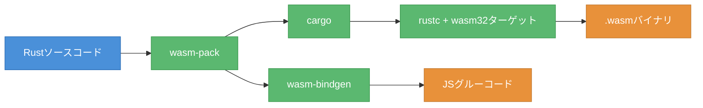
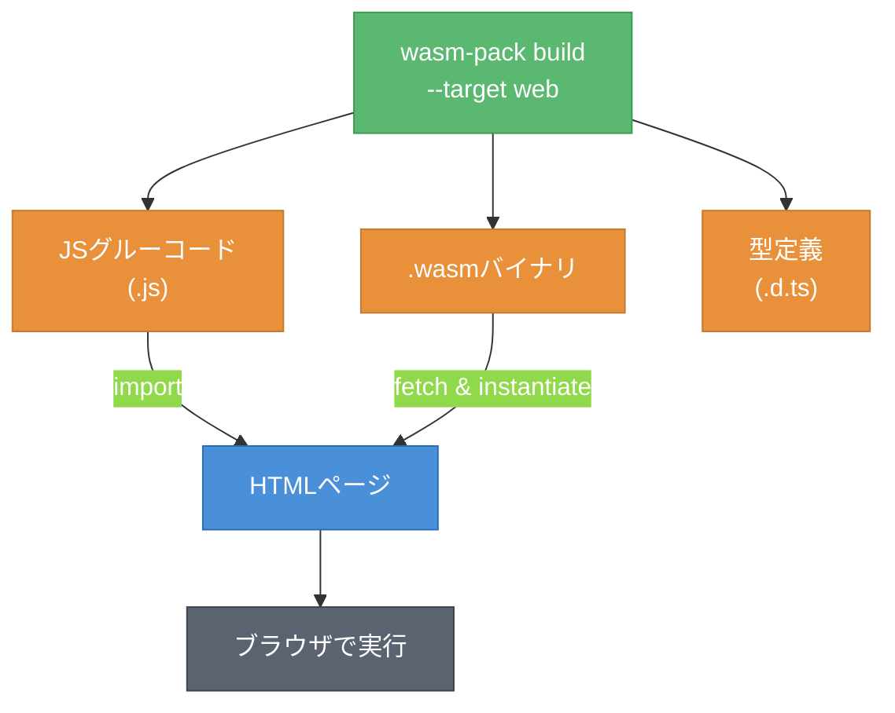

# 第2章 最小実装から理解する ― Rust + wasm-pack入門

第1章では、WASMの本質が「ポータブルなバイトコード」であること、そして複数の言語からコンパイル可能なバイナリフォーマットであることを確認した。本章では、実際にRustでWASMモジュールを作成し、ブラウザで動作させる。サンプルアプリ「WASM Image Filter」の第一歩として、グレースケール変換を実装する。

---

## 2.1 開発環境のセットアップ

WASMモジュールをRustで作成するには、Rust本体に加えてwasm-packが必要である。wasm-packは、Rustコードのコンパイルからnpmパッケージの生成までを一括で行うツールである。

図2.1に、ツールチェーンの関係を示す。



**図2.1: ツールチェーンの関係 ― wasm-packがビルドパイプライン全体を統括する**

wasm-packは内部でcargoを呼び出してRustコードをコンパイルし、wasm-bindgenでJavaScriptとのバインディングコード（JSグルーコード）を生成する。開発者はwasm-packコマンドひとつでビルドが完結する。

セットアップ手順は以下の通りである。

```bash
# Rustのインストール
curl --proto '=https' --tlsv1.2 -sSf https://sh.rustup.rs | sh

# wasm-packのインストール
cargo install wasm-pack

# wasm32ターゲットの追加
rustup target add wasm32-unknown-unknown
```

インストール後、プロジェクトを初期化する。

```bash
# ライブラリプロジェクトとして初期化
cargo init --lib rust --name wasm-image-filter
```

`Cargo.toml`に以下の設定を追加する。`crate-type = ["cdylib"]`がWASMバイナリ生成に必要な指定である。

```toml
[lib]
crate-type = ["cdylib", "rlib"]

[dependencies]
wasm-bindgen = "0.2"
console_error_panic_hook = "0.1"
```

wasm-bindgenはRust関数をJavaScriptから呼び出し可能にするライブラリである。`console_error_panic_hook`はパニック発生時にブラウザコンソールへスタックトレースを出力する（第3章で詳しく解説する）。

---

## 2.2 Hello WASM ― 最初のWASMモジュール

最初のWASMモジュールとして、数値を受け取って2倍にする関数を作成する。

```rust
use wasm_bindgen::prelude::*;

// JavaScript から呼び出し可能な関数としてエクスポート
#[wasm_bindgen]
pub fn double(x: i32) -> i32 {
    x * 2
}
```

`#[wasm_bindgen]`アトリビュートを付けた関数は、ビルド時にJavaScriptから呼び出せるようにエクスポートされる。

図2.2に、ビルドから実行までの流れを示す。



**図2.2: ビルドから実行までのフロー ― wasm-packが3種類のファイルを生成する**

ビルドコマンドを実行する。

```bash
wasm-pack build --target web --release
```

`--target web`を指定すると、ES Modulesとして読み込めるJSグルーコードが生成される。`pkg/`ディレクトリに以下のファイルが出力される。

- `wasm_image_filter_bg.wasm` ― WASMバイナリ本体
- `wasm_image_filter.js` ― JSグルーコード（init関数、エクスポート関数のラッパー）
- `wasm_image_filter.d.ts` ― TypeScript型定義

HTMLからは以下のように呼び出す。

```html
<script type="module">
    // JSグルーコードからinit関数とエクスポート関数をインポート
    import init, { double } from './pkg/wasm_image_filter.js';

    // WASMモジュールの初期化（.wasmファイルのfetchと検証）
    await init();

    // Rust関数の呼び出し
    console.log(double(21)); // 42
</script>
```

`init()`がWASMバイナリの読み込みと検証を行い、それ以降は`double()`のようにJavaScriptの通常の関数と同じ感覚で呼び出せる。JSグルーコードが型変換やメモリ管理を裏側で処理している。

---

## 2.3 サンプルアプリ: グレースケール変換

サンプルアプリの第一段階として、画像のグレースケール変換をWASMで実装する。画像はRGBA形式のバイト配列（1ピクセル = 4バイト）として表現され、Canvas APIの`getImageData()`で取得できる。

図2.3に、データフローを示す。


**図2.3: グレースケール変換のデータフロー ― CanvasとWASM間でバイト配列を受け渡す**

Rust側の実装は以下の通りである。

```rust
use wasm_bindgen::prelude::*;

/// グレースケール変換
/// RGBA形式のピクセルデータを受け取り、輝度値に変換して返す
#[wasm_bindgen]
pub fn grayscale(pixels: &[u8]) -> Vec<u8> {
    let mut output = Vec::with_capacity(pixels.len());

    // 4バイト（RGBA）ずつ処理
    for chunk in pixels.chunks(4) {
        let r = chunk[0] as f32;
        let g = chunk[1] as f32;
        let b = chunk[2] as f32;
        let a = chunk[3];

        // ITU-R BT.601（テレビ映像の輝度計算に関する国際規格）の係数
        let gray = (0.299 * r + 0.587 * g + 0.114 * b) as u8;

        output.push(gray); // R
        output.push(gray); // G
        output.push(gray); // B
        output.push(a);    // A（透過度はそのまま）
    }

    output
}
```

関数のシグネチャ`pixels: &[u8]`はバイトスライスの参照、戻り値`Vec<u8>`はバイト配列を意味する。wasm-bindgenが自動的にJavaScriptの`Uint8Array`との変換を行うため、Rust側ではRustの標準的な型をそのまま使える。

輝度計算にはITU-R BT.601の係数（R: 0.299、G: 0.587、B: 0.114）を使用している。人間の目は緑に最も敏感であるため、緑の係数が最も大きい。

JavaScript側の呼び出しコードは以下の通りである。

```javascript
import init, { grayscale } from '../rust/pkg/wasm_image_filter.js';

await init();

// CanvasからピクセルデータをUint8Arrayとして取得
const imageData = ctx.getImageData(0, 0, width, height);

// WASMのgrayscale関数を呼び出し
const result = grayscale(new Uint8Array(imageData.data.buffer));

// 結果をCanvasに描画
const output = new ImageData(
    new Uint8ClampedArray(result),
    width,
    height
);
ctx.putImageData(output, 0, 0);
```

`getImageData()`でRGBA形式のバイト配列を取得し、WASMの`grayscale()`に渡す。戻り値も同じRGBA形式のバイト配列であるため、`ImageData`を生成して`putImageData()`でCanvasに描画する。

---

## 2.4 言語比較: TinyGoとPyodide

RustはWASM開発で最も使用されている言語である[^1]が、唯一の選択肢ではない。TinyGoとPyodideを使えば、GoやPythonからもWASMを生成できる。

以下はTinyGoで同等のグレースケール変換を実装した例である。

```go
package main

import "syscall/js"

// グレースケール変換（TinyGo版）
//
//export grayscale
func grayscale(this js.Value, args []js.Value) interface{} {
    input := args[0] // Uint8Array
    length := input.Get("length").Int()
    output := make([]byte, length)

    for i := 0; i < length; i += 4 {
        r := float64(input.Index(i).Int())
        g := float64(input.Index(i + 1).Int())
        b := float64(input.Index(i + 2).Int())
        // ITU-R BT.601
        gray := byte(0.299*r + 0.587*g + 0.114*b)
        output[i] = gray
        output[i+1] = gray
        output[i+2] = gray
        output[i+3] = byte(input.Index(i + 3).Int())
    }

    result := js.Global().Get("Uint8Array").New(length)
    js.CopyBytesToJS(result, output)
    return result
}

func main() {}
```

TinyGoではwasm-bindgenに相当する仕組みがないため、`syscall/js`パッケージでJavaScriptオブジェクトを直接操作する必要がある。Rustと比較してバインディングの記述量が多い。

表2.1に、各言語の比較を示す。

**表2.1: 言語別WASMビルド比較**

| 項目 | Rust (wasm-pack) | Go (TinyGo) | Python (Pyodide) |
|------|-----------------|-------------|-----------------|
| バイナリサイズ | 約20KB〜[^2] | 約200KB〜[^2] | 約6〜7MB（コアランタイム）[^3] |
| ビルド時間 | 数秒 | 数秒 | 不要（実行時コンパイル） |
| エコシステム成熟度 | 高い | 中程度 | 発展途上 |
| 型安全性 | 高い | 高い | 低い |
| 適したユースケース | 性能重視のモジュール | 既存Goコードの移植 | 科学計算、プロトタイプ |

Rustはバイナリサイズが最も小さく、wasm-bindgenによるJavaScript連携のエコシステムも充実している。TinyGoは既存のGoコードベースをWASMに移植する場合に有効だが、標準ライブラリの一部が使用できない制約がある。Pyodideはコアランタイムだけで約6〜7MBと大きいが、NumPy等のPythonライブラリをブラウザ上で実行できる独自の利点を持つ。

本書ではRustを主要言語として使用する。バイナリサイズの小ささ、型安全性、wasm-bindgenによる充実したJavaScript連携が、サンプルアプリの開発に適しているためである。

---

グレースケール変換は動作するが、現時点ではデータの受け渡しがコピーベースである。`grayscale()`を呼び出すたびに、JavaScriptからWASMへ、そしてWASMからJavaScriptへとデータがコピーされている。次章では、WASMの線形メモリとJavaScriptのArrayBufferの関係を理解し、より効率的なメモリ共有を実現する。セピアやぼかしフィルタの追加も行う。

---

## 理解度チェック

### Q1. wasm-bindgenの役割

**種類**: 概念の確認

**難易度**: 基礎

**問題文**:
`#[wasm_bindgen]`アトリビュートを付けた関数に対して、wasm-bindgenはどのような処理を行うか。

<details>
<summary>解答と解説</summary>

**解答**: wasm-bindgenは、Rust関数をJavaScriptから呼び出し可能にするためのJSグルーコード（ラッパー関数）を自動生成する。引数と戻り値の型変換（例: `&[u8]` ↔ `Uint8Array`）も自動的に処理する。

**解説**: 2.2節で示した通り、wasm-packのビルド時にwasm-bindgenが呼ばれ、`.js`ファイル（JSグルーコード）と`.d.ts`ファイル（TypeScript型定義）が生成される。開発者はRust側で標準的な型を使うだけでよい。

**関連する節**: 2.2節

</details>

---

### Q2. WASMへのデータ受け渡し

**種類**: 概念の確認

**難易度**: 基礎

**問題文**:
サンプルアプリのグレースケール変換で、JavaScript側の画像データ（`ImageData`）はどのような形式でWASM関数に渡されるか。

<details>
<summary>解答と解説</summary>

**解答**: `ImageData`の`data`プロパティからRGBA形式のバイト配列（`Uint8Array`）を取得し、WASMの`grayscale()`関数に渡す。wasm-bindgenが`Uint8Array`をRustの`&[u8]`に変換する。

**解説**: 2.3節のコード例に示した通り、Canvas APIの`getImageData()`で取得した`ImageData.data`は`Uint8ClampedArray`であり、これを`Uint8Array`に変換してWASM関数に渡す。1ピクセルあたり4バイト（R, G, B, A）で構成される。

**関連する節**: 2.3節

</details>

---

### Q3. WASM開発言語の選択

**種類**: 判断問題

**難易度**: 応用

**問題文**:
以下のプロジェクト要件に対して、Rust、TinyGo、Pyodideのうち最も適切な言語はどれか。

「既存のGoで書かれたテキスト解析ライブラリをブラウザ上で動作させたい。ライブラリは標準ライブラリのstringsパッケージに依存している。」

**選択肢**:
- (a) Rust（wasm-pack）
- (b) Go（TinyGo）
- (c) Python（Pyodide）

<details>
<summary>解答と解説</summary>

**解答**: (b)

**解説**: 既存のGoコードベースを活用するにはTinyGoが最適である。Rustへの移植はコードの書き直しが必要になる。Pyodideはそもそもpython向けである。ただし、TinyGoでは標準ライブラリの一部が使用できない制約があるため、実際の移植時には互換性を事前に確認する必要がある。表2.1に示した通り、TinyGoの適したユースケースは「既存Goコードの移植」である。

**関連する節**: 2.4節

</details>

---

## 参考文献

[^1]: Scott Loganbill "State of WebAssembly 2023" -- RustがWASM開発で3年連続最も使用されている言語。https://www.infoworld.com/article/2335881/rust-is-most-popular-webassembly-language-survey-says.html
[^2]: バイナリサイズはリリースビルド・最適化オプションにより変動する。Rust: https://rustwasm.github.io/book/game-of-life/code-size.html / TinyGo: https://www.fermyon.com/blog/optimizing-tinygo-wasm
[^3]: Pyodide公式 https://pyodide.org/ 。NumPy等のライブラリを含めると10MB以上になる。

- Rust and WebAssembly Working Group "The wasm-bindgen Guide", https://rustwasm.github.io/docs/wasm-bindgen/
- wasm-pack documentation, https://rustwasm.github.io/docs/wasm-pack/
