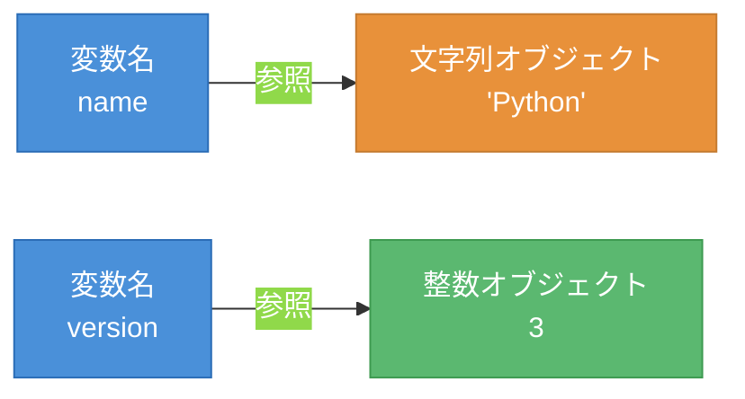

# 第2章 変数とデータ型 ― 値を名前で管理する

第1章では`print()`関数で固定の文字列を出力した。しかし、実用的なプログラムでは値を保存し、加工し、再利用する必要がある。本章では、値に名前を付けて管理する仕組みである変数（Variable）を学ぶ。あわせてPythonが扱うデータ型（Data Type）と、値を操作するための演算子（Operator）を扱う。

## 2.1 変数と代入

まず、変数の基本的な使い方を見る。

```python
# 変数に値を代入する
name = "Python"
version = 3
print(name)     # Python
print(version)  # 3
```

`=`は代入演算子である。右辺の値を左辺の変数名に紐づける。図2.1に、変数と値の関係を示す。



**図2.1: 変数と値の関係（参照モデル）**

変数は値そのものを格納するのではなく、値（オブジェクト）への参照を保持する。変数には別の値を再代入できる。

```python
# 再代入と動的型付け
x = 10       # 整数を代入
print(x)     # 10
x = "hello"  # 文字列を再代入（型が変わる）
print(x)     # hello
```

Pythonは動的型付け（Dynamic Typing）言語である。変数の型を事前に宣言する必要がなく、代入する値によって型が自動的に決まる。

### 変数名の命名規則

変数名には以下のルールがある。

- 英字・数字・アンダースコアが使用可能（先頭に数字は不可）
- 大文字と小文字は区別される（`name`と`Name`は別の変数）
- 予約語（`if`, `for`, `return`等）は使用不可
- 慣例としてスネークケース（`my_variable`）を使用する

## 2.2 基本データ型

Pythonには複数のデータ型が用意されている。`type()`関数で値の型を確認できる。

```python
# type()関数で型を確認する
print(type(42))        # <class 'int'>
print(type(3.14))      # <class 'float'>
print(type("hello"))   # <class 'str'>
print(type(True))      # <class 'bool'>
```

表2.1に、基本的なデータ型をまとめる。

**表2.1: 基本データ型の一覧**

| データ型 | 名称 | 説明 | 例 |
|---------|------|------|-----|
| `int` | 整数型（Integer） | 整数を表す。精度の制限がない | `42`, `-7`, `0` |
| `float` | 浮動小数点型（Float） | 小数を表す | `3.14`, `-0.5`, `1.0` |
| `str` | 文字列型（String） | テキストデータを表す | `"hello"`, `'Python'` |
| `bool` | ブール型（Boolean） | 真偽値を表す | `True`, `False` |

型変換（Type Conversion）を使うと、ある型の値を別の型に変換できる。

```python
# 型変換の例
age = int("25")        # 文字列→整数
price = float("19.99") # 文字列→浮動小数点数
label = str(100)       # 整数→文字列
print(age + 5)         # 30
print(label + "円")    # 100円
```

## 2.3 演算子

値に対する操作を行うための記号が演算子である。表2.2に主要な演算子をまとめる。

**表2.2: 演算子の種類と動作**

| 分類 | 演算子 | 意味 | 例 | 結果 |
|------|-------|------|-----|------|
| 算術 | `+` | 加算 | `7 + 3` | `10` |
| 算術 | `-` | 減算 | `7 - 3` | `4` |
| 算術 | `*` | 乗算 | `7 * 3` | `21` |
| 算術 | `/` | 除算（浮動小数点） | `7 / 3` | `2.333...` |
| 算術 | `//` | 除算（切り捨て） | `7 // 3` | `2` |
| 算術 | `%` | 剰余 | `7 % 3` | `1` |
| 算術 | `**` | べき乗 | `2 ** 3` | `8` |
| 比較 | `==` | 等しい | `3 == 3` | `True` |
| 比較 | `!=` | 等しくない | `3 != 4` | `True` |
| 比較 | `<`, `>` | より小さい/大きい | `3 < 5` | `True` |
| 比較 | `<=`, `>=` | 以下/以上 | `5 >= 5` | `True` |
| 論理 | `and` | かつ | `True and False` | `False` |
| 論理 | `or` | または | `True or False` | `True` |
| 論理 | `not` | 否定 | `not True` | `False` |

```python
# 算術演算子の使用例
total = 100 + 200
print(total)       # 300
print(7 / 3)       # 2.3333333333333335
print(7 // 3)      # 2（小数点以下を切り捨て）
print(7 % 3)       # 1（余り）
print(2 ** 10)     # 1024
```

`/`は常に浮動小数点数を返し、`//`は整数の切り捨て除算を行う。この違いは頻出するため注意が必要である。

```python
# 比較演算子と論理演算子
score = 85
print(score >= 80)              # True
print(score >= 80 and score < 90)  # True
print(not (score < 60))         # True
```

比較演算子はブール値（`True`または`False`）を返す。論理演算子は複数の条件を組み合わせるのに使用する。これらは第3章で学ぶ条件分岐の基礎となる。

### 文字列の演算

文字列に対しても`+`と`*`が使用できる。

```python
# 文字列の結合と繰り返し
greeting = "Hello" + " " + "World"
print(greeting)    # Hello World
line = "-" * 20
print(line)        # --------------------
```

`+`は文字列の結合、`*`は文字列の繰り返しを行う。数値と文字列を`+`で結合するとエラーになるため、`str()`で型変換する必要がある。

---

本章では、変数にさまざまな型の値を格納し、演算子で操作する方法を学んだ。特に比較演算子が返すブール値は、次の第3章で扱う条件分岐の判定条件として重要な役割を果たす。

---

## 理解度チェック

### Q1. 動的型付けとは何か

**種類**: 概念の確認

**難易度**: 基礎

**問題文**:
Pythonが「動的型付け言語」であるとはどういう意味か、コード例を用いて説明せよ。

<details>
<summary>解答と解説</summary>

**解答**: 動的型付けとは、変数の型を事前に宣言する必要がなく、代入する値によって型が自動的に決まる仕組みである。同じ変数に異なる型の値を再代入することも可能である。

```python
x = 10       # xはint型
x = "hello"  # xはstr型に変わる
```

**解説**: 静的型付け言語（Java、C等）では変数の型を宣言時に固定するが、Pythonでは代入のたびに型が変わりうる。これにより柔軟なコードが書ける反面、型の不一致によるエラーが実行時まで検出されない場合がある。

**関連する節**: 2.1節

</details>

---

### Q2. 式の実行結果を予測する

**種類**: 判断問題

**難易度**: 基礎

**問題文**:
以下の各式の実行結果を予測せよ。

```python
print(10 / 3)
print(10 // 3)
print(10 % 3)
print(2 ** 4)
```

**選択肢**:
- (a) `3.3333333333333335`, `3`, `1`, `16`
- (b) `3`, `3`, `1`, `16`
- (c) `3.3333333333333335`, `3`, `1`, `8`
- (d) `3.0`, `3`, `1`, `16`

<details>
<summary>解答と解説</summary>

**解答**: (a)

**解説**: `/`は浮動小数点除算で`3.3333333333333335`を返す。`//`は切り捨て除算で`3`を返す。`%`は剰余で`1`を返す。`**`はべき乗で`2の4乗 = 16`を返す。特に`/`が常に浮動小数点数を返す点に注意が必要である。

**関連する節**: 2.3節

</details>

---

### Q3. 除算演算子の違い

**種類**: 概念の確認

**難易度**: 基礎

**問題文**:
`/`と`//`の違いを説明し、それぞれの適切な使用場面を述べよ。

<details>
<summary>解答と解説</summary>

**解答**: `/`は浮動小数点除算であり、結果は常に`float`型になる。`//`は切り捨て除算であり、小数点以下を切り捨てた整数を返す。`/`は正確な除算結果が必要な場合（金額の計算等）に使い、`//`は整数の商が必要な場合（ページ数の計算、グループ分け等）に使う。

**解説**: `7 / 2`は`3.5`を返し、`7 // 2`は`3`を返す。`//`は「床除算」（Floor Division）とも呼ばれ、結果を負の無限大方向に丸める。

**関連する節**: 2.3節

</details>
