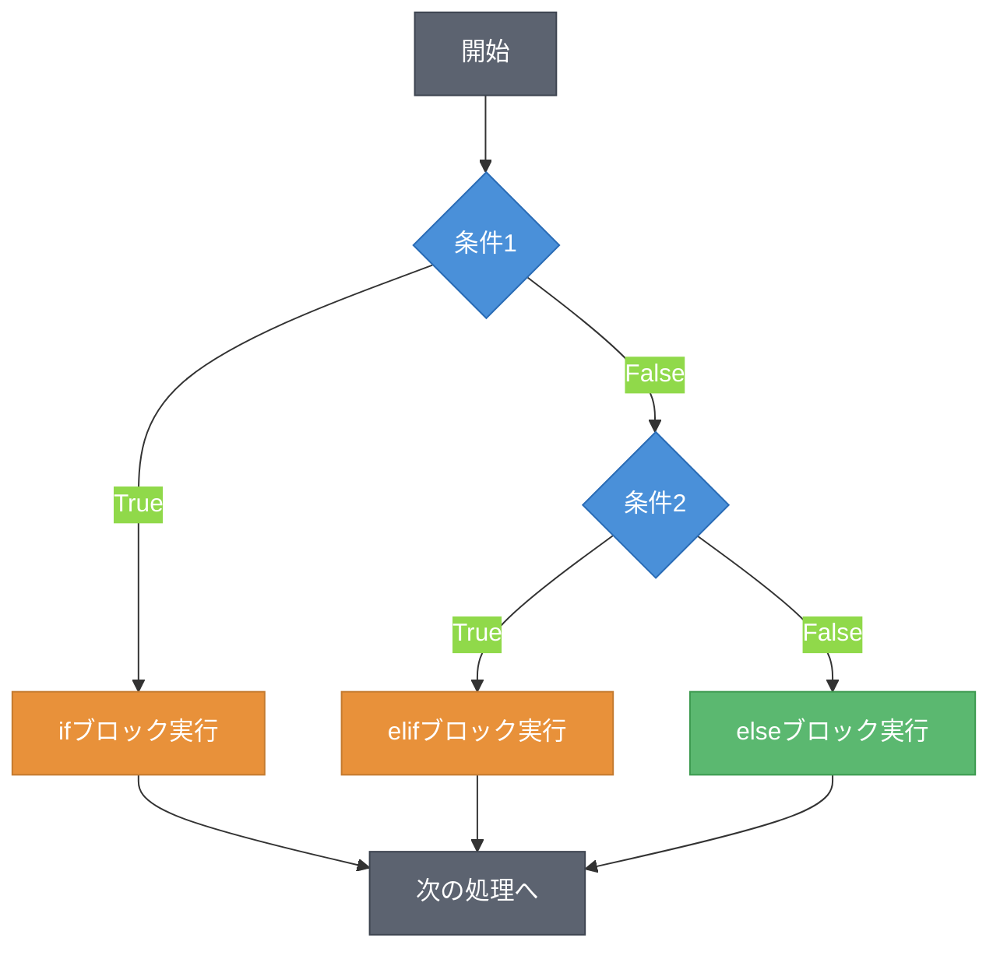
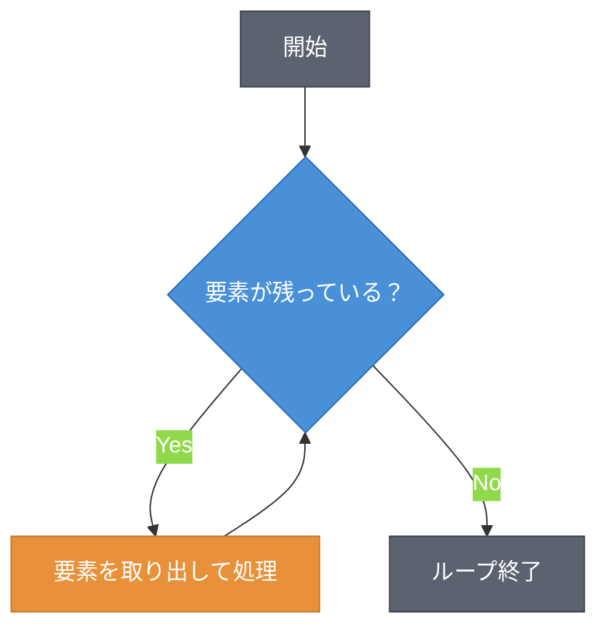
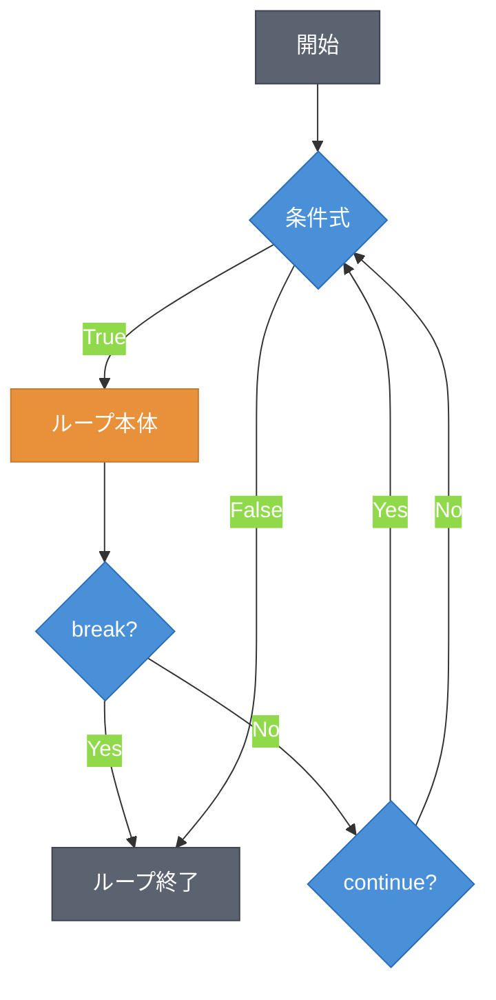
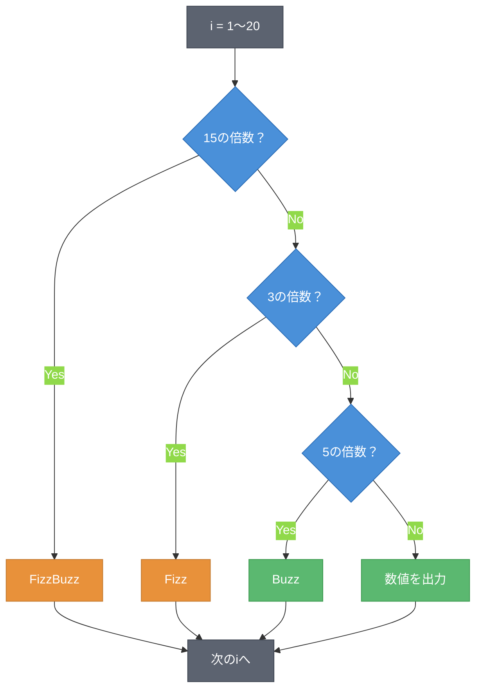

# 第3章 制御フロー ― 条件によって動きを変える

第2章では、比較演算子や論理演算子がブール値を返すことを学んだ。本章では、このブール値を使ってプログラムの実行順序を制御する方法を学ぶ。条件分岐（Conditional Branch）で処理を分け、ループ（Loop）で処理を繰り返す。

## 3.1 条件分岐（if文）

条件に応じて実行する処理を切り替えるには、`if`文を使う。図3.1に条件分岐の実行フローを示す。



**図3.1: 条件分岐の実行フロー（if/elif/else）**

`if`文は条件式が`True`の場合にブロック内を実行する。

```python
# 成績判定プログラム
score = 85

if score >= 90:
    print("評価: A")
elif score >= 80:
    print("評価: B")
elif score >= 70:
    print("評価: C")
else:
    print("評価: D")
# 出力: 評価: B
```

Pythonではインデント（4スペース）がブロックを定義する。他の多くの言語が波括弧`{}`を使うのに対し、Pythonはインデントの深さで処理のまとまりを表現する。`elif`で複数の条件を順に判定し、`else`でどの条件にも合致しない場合を処理する。

条件分岐はネスト（入れ子）にもできる。

```python
# ネストした条件分岐
age = 20
has_ticket = True

if age >= 18:
    if has_ticket:
        print("入場可能")
    else:
        print("チケットが必要です")
else:
    print("18歳以上が対象です")
# 出力: 入場可能
```

ネストが深くなるとコードの可読性が下がる。条件が複雑な場合は論理演算子（`and`、`or`）で条件を結合する方法も有効である。

## 3.2 forループ

同じ処理を繰り返すにはループを使う。forループ（for Loop）はイテラブル（Iterable）の要素を順に取り出して処理する。図3.2にforループの実行フローを示す。



**図3.2: forループの実行フロー**

```python
# forループの基本
fruits = ["apple", "banana", "cherry"]
for fruit in fruits:
    print(fruit)
# 出力: apple, banana, cherry（各行に1つずつ）
```

`range()`関数を使うと、連続する整数のシーケンスを生成できる。

```python
# range()で数値の繰り返し
for i in range(5):
    print(i)
# 出力: 0, 1, 2, 3, 4（0から始まり、5は含まない）

# range(開始, 終了, ステップ)
for i in range(1, 10, 2):
    print(i)
# 出力: 1, 3, 5, 7, 9
```

`enumerate()`を使うと、インデックスと要素を同時に取得できる。

```python
# enumerate()でインデックス付き反復
colors = ["red", "green", "blue"]
for i, color in enumerate(colors):
    print(f"{i}: {color}")
# 出力: 0: red, 1: green, 2: blue
```

## 3.3 whileループ

whileループ（while Loop）は、条件式が`True`である間ブロックを繰り返す。図3.3にwhileループの実行フローを示す。



**図3.3: whileループとbreak/continueの動作**

```python
# whileループの基本
count = 0
while count < 5:
    print(count)
    count += 1
# 出力: 0, 1, 2, 3, 4
```

`break`はループを即座に中断し、`continue`は残りの処理をスキップして次のイテレーションに進む。

```python
# breakとcontinueの例
for i in range(10):
    if i == 3:
        continue  # 3をスキップ
    if i == 7:
        break     # 7でループ終了
    print(i)
# 出力: 0, 1, 2, 4, 5, 6
```

`while True`による無限ループは、ループ内の`break`で終了する。終了条件を必ず設けること。

```python
# 無限ループとbreak
while True:
    text = input("入力してください（qで終了）: ")
    if text == "q":
        break
    print(f"入力値: {text}")
```

## 3.4 制御フローの組み合わせ

条件分岐とループを組み合わせると、実践的なプログラムが書ける。代表的な例としてFizzBuzzを実装する。FizzBuzzは、1から順に数を出力し、3の倍数で「Fizz」、5の倍数で「Buzz」、15の倍数で「FizzBuzz」を出力する問題である。図3.4にフローチャートを示す。



**図3.4: FizzBuzzのフローチャート**

```python
# FizzBuzz
for i in range(1, 21):
    if i % 15 == 0:
        print("FizzBuzz")
    elif i % 3 == 0:
        print("Fizz")
    elif i % 5 == 0:
        print("Buzz")
    else:
        print(i)
```

ループ内で`if`/`elif`/`else`を使い、条件に応じた出力を行っている。`%`（剰余演算子）で倍数判定を行い、15の倍数を最初に判定する点がポイントである。15は3と5の公倍数であるため、先に3や5の倍数を判定すると15の倍数が正しく処理されない。

---

本章では、条件分岐とループによる制御フローを学んだ。FizzBuzzではこれらを組み合わせて実践的な処理を書いた。`for`ループで繰り返した「複数のデータ」を効率的に管理するには、専用のデータ構造が必要である。次の第4章では、リストや辞書といったデータ構造を学ぶ。

---

## 理解度チェック

### Q1. forループとwhileループの使い分け

**種類**: 概念の確認

**難易度**: 基礎

**問題文**:
`for`ループと`while`ループの違いを説明し、それぞれの適切な使用場面を述べよ。

<details>
<summary>解答と解説</summary>

**解答**: `for`ループはイテラブルの要素を順に処理する場合に使用する。繰り返し回数が事前に決まっている場面に適している。`while`ループは条件式が`True`である間繰り返す場合に使用する。繰り返し回数が事前にわからない場面（ユーザー入力の待機等）に適している。

**解説**: `for`ループは`range()`やリスト等のイテラブルと組み合わせて使う。`while`ループは条件ベースの制御に使い、`break`で明示的に終了させるパターンが多い。

**関連する節**: 3.2節、3.3節

</details>

---

### Q2. コードの実行結果を予測する

**種類**: 判断問題

**難易度**: 基礎

**問題文**:
以下のコードの出力を予測せよ。

```python
for i in range(5):
    if i == 2:
        continue
    if i == 4:
        break
    print(i)
```

**選択肢**:
- (a) `0, 1, 3`
- (b) `0, 1, 2, 3`
- (c) `0, 1, 3, 4`
- (d) `0, 1`

<details>
<summary>解答と解説</summary>

**解答**: (a)

**解説**: `i=0`と`i=1`は条件に該当しないため出力される。`i=2`では`continue`により`print(i)`がスキップされる。`i=3`は出力される。`i=4`では`break`によりループが終了し、`print(i)`は実行されない。

**関連する節**: 3.3節

</details>

---

### Q3. breakとcontinueの違い

**種類**: 概念の確認

**難易度**: 基礎

**問題文**:
`break`と`continue`の動作の違いを説明せよ。

<details>
<summary>解答と解説</summary>

**解答**: `break`はループ全体を即座に終了させる。`continue`は現在のイテレーションの残りの処理をスキップし、次のイテレーションに進む。`break`はループの外に抜けるが、`continue`はループ内に留まる。

**解説**: `break`はループの終了条件を途中で満たした場合に使う。`continue`は特定の条件に該当する要素の処理をスキップしたい場合に使う。

**関連する節**: 3.3節

</details>

---

### Q4. 偶数の合計を求めるコード

**種類**: 設計問題

**難易度**: 応用

**問題文**:
1から100までの偶数の合計を求めるプログラムを書け。`for`ループと条件分岐を使用すること。

<details>
<summary>解答と解説</summary>

**解答**:
```python
total = 0
for i in range(1, 101):
    if i % 2 == 0:
        total += i
print(total)  # 2550
```

**解説**: `range(1, 101)`で1から100までの整数を生成し、`i % 2 == 0`で偶数を判定する。偶数の場合のみ`total`に加算する。別解として`range(2, 101, 2)`を使えば条件分岐なしで偶数のみを生成できる。

**関連する節**: 3.2節、3.1節

</details>
