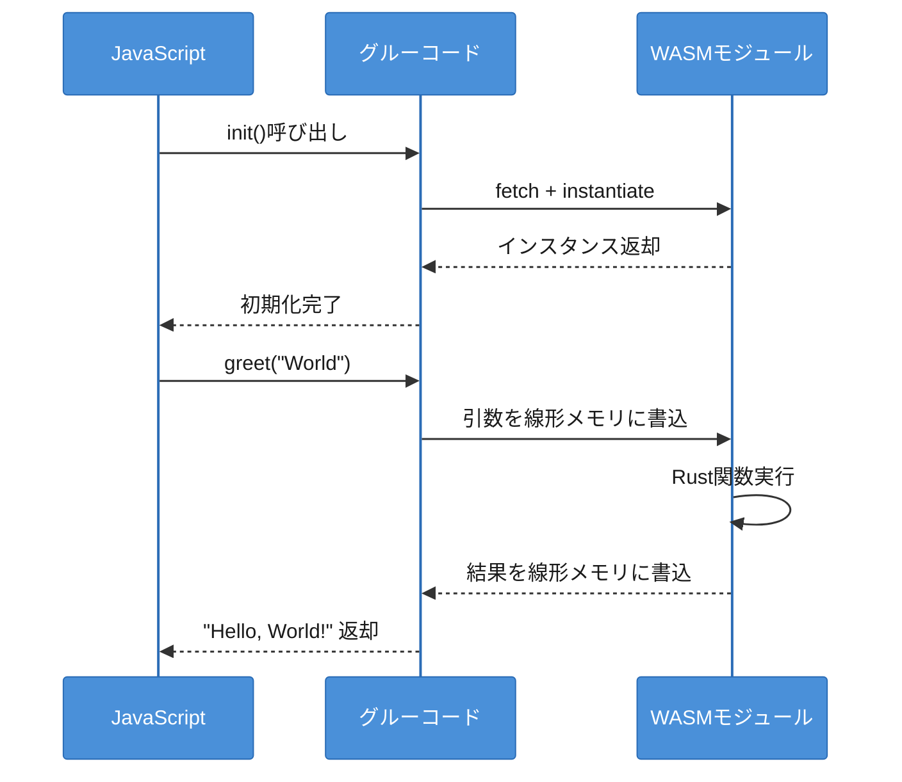
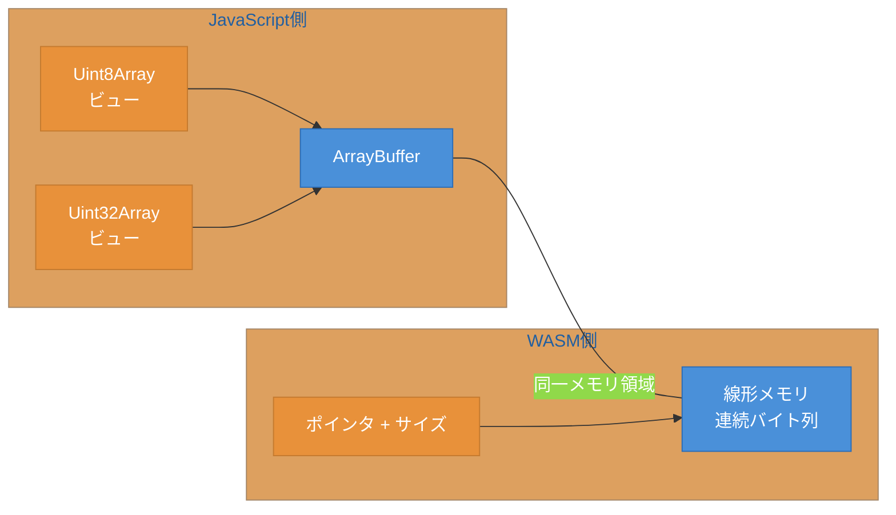

# 第3章 JavaScriptとの連携 ― 型変換とメモリ共有

第2章では、Rustとwasm-packを使ってWASMモジュールを作成し、wasm-bindgenによる基本的な型変換を学んだ。しかし、実用的なアプリケーションを構築するには、より高度な連携パターンが必要になる。

本章では、JavaScriptからWASM関数を呼び出す際のパターンとエラーハンドリングを解説する。さらに、線形メモリとArrayBufferを介したバイナリデータの共有、画像フィルタ処理を通じた実践的な連携を学ぶ。

## 3.1 WASM関数の呼び出しパターン

JavaScriptからWASMモジュールを利用するには、モジュールのロード、インスタンス化、関数呼び出しという三つのステップを踏む。図3.1に、この一連のフローを示す。



図3.1: JS-WASM間の関数呼び出しフロー

wasm-packが生成するグルーコードを使う場合、`init()`で初期化した後は通常の関数呼び出しと同じ感覚で利用できる。しかし、低レベルのWebAssembly APIを直接使う場合は、手動でモジュールのロードとインスタンス化を行う必要がある。

```javascript
// WebAssembly APIを直接使った関数呼び出しとエラーハンドリング
async function loadWasm() {
    try {
        // WASMモジュールのフェッチとインスタンス化
        const response = await fetch('module.wasm');
        const { instance } = await WebAssembly.instantiateStreaming(
            response,
            {} // インポートオブジェクト
        );

        // エクスポートされた関数の呼び出し
        const result = instance.exports.add(2, 3);
        console.log(result); // 5
    } catch (error) {
        if (error instanceof WebAssembly.CompileError) {
            // WASMバイナリの形式エラー
            console.error("コンパイルエラー:", error.message);
        } else if (error instanceof WebAssembly.RuntimeError) {
            // 実行時エラー（スタックオーバーフロー等）
            console.error("ランタイムエラー:", error.message);
        }
    }
}
```

コード3.1: WASM関数の呼び出しとエラーハンドリング

WASMのエラーは三種類に分類される。`CompileError`はバイナリ形式の不正、`LinkError`はインポートの不一致、`RuntimeError`は実行時の異常（ゼロ除算、メモリ範囲外アクセス等）である。wasm-bindgenを使う場合、Rust側の`panic!`はJavaScript側で例外として捕捉できる。

## 3.2 メモリ共有の仕組み ― ArrayBufferと線形メモリ

WASMモジュールが使用する線形メモリ（Linear Memory）は、JavaScript側からはArrayBufferとして参照できる。ArrayBufferはJavaScriptで固定長のバイナリデータバッファを表すオブジェクトである。この仕組みにより、大量のバイナリデータを効率的に受け渡すことが可能になる。図3.2に、両者の関係を示す。



図3.2: WASMの線形メモリとArrayBufferの関係

線形メモリとArrayBufferは同一のメモリ領域を指す。JavaScript側からは`Uint8Array`や`Uint32Array`等のTypedArrayビューを通じてデータにアクセスする。WASM側からはポインタとサイズでアクセスする。

以下に、線形メモリを介したバイナリデータの受け渡し例を示す。

```rust
// src/lib.rs - 線形メモリを介したデータ処理
use wasm_bindgen::prelude::*;

// WASMの線形メモリへのポインタを返す関数
#[wasm_bindgen]
pub fn alloc(size: usize) -> *mut u8 {
    // Vecを確保し、ポインタを返す
    let mut buf = Vec::with_capacity(size);
    let ptr = buf.as_mut_ptr();
    std::mem::forget(buf); // Rustのドロップを抑制
    ptr
}

// ポインタとサイズでデータを受け取り、合計値を返す
#[wasm_bindgen]
pub fn sum_bytes(ptr: *const u8, len: usize) -> u32 {
    let data = unsafe { std::slice::from_raw_parts(ptr, len) };
    data.iter().map(|&b| b as u32).sum()
}
```

```javascript
// JavaScript側 - 線形メモリへの直接書き込み
const memory = instance.exports.memory;
const ptr = instance.exports.alloc(4);

// TypedArrayビューで線形メモリに書き込む
const view = new Uint8Array(memory.buffer, ptr, 4);
view.set([10, 20, 30, 40]);

// WASM関数にポインタとサイズを渡す
const total = instance.exports.sum_bytes(ptr, 4);
console.log(total); // 100
```

コード3.2: 線形メモリを介したバイナリデータの受け渡し

メモリの成長（grow）には注意が必要である。WASMモジュールが`memory.grow()`を呼ぶと、線形メモリのサイズが拡張される。このとき、既存のArrayBufferは無効化され、新しいArrayBufferが割り当てられる。JavaScript側で保持していたTypedArrayビューも無効になるため、`memory.grow()`後は必ずビューを再取得する必要がある。

```javascript
// memory.grow()後のビュー再取得（重要）
instance.exports.some_function_that_grows_memory();
// 古いビューは無効化されている
// 新しいビューを取得する
const newView = new Uint8Array(memory.buffer);
```

## 3.3 実例：画像フィルタ処理

メモリ共有の仕組みを理解したところで、実践的な例として画像のグレースケール変換フィルタを実装する。Canvas APIからピクセルデータを取得し、WASMで処理して結果をCanvasに戻す流れである。図3.3に、データフローを示す。


図3.3: 画像フィルタ処理のデータフロー ― Canvas → WASM → Canvas

まず、Rust側でグレースケール変換フィルタを実装する。

```rust
// src/lib.rs - グレースケールフィルタ（Vec<u8>版）
use wasm_bindgen::prelude::*;

/// RGBAピクセルデータをグレースケールに変換する
/// wasm-bindgenがVec<u8>の受け渡しを自動処理する
#[wasm_bindgen]
pub fn grayscale(mut data: Vec<u8>) -> Vec<u8> {
    // 4バイトずつ（RGBA）処理する
    for chunk in data.chunks_exact_mut(4) {
        let r = chunk[0] as f32;
        let g = chunk[1] as f32;
        let b = chunk[2] as f32;

        // 輝度計算（ITU-R BT.601）
        let gray = (0.299 * r + 0.587 * g + 0.114 * b) as u8;

        chunk[0] = gray; // R
        chunk[1] = gray; // G
        chunk[2] = gray; // B
        // chunk[3] (A) はそのまま
    }
    data
}
```

コード3.3: グレースケールフィルタのRust実装

輝度計算にはITU-R BT.601の係数を使用している。この係数は人間の視覚特性に基づいており、緑の寄与が最も大きい。wasm-bindgenは`Vec<u8>`の引数と戻り値を自動的に線形メモリ経由で受け渡すため、手動のポインタ操作は不要である。

次に、JavaScript側でCanvas APIとWASMを統合する。

```javascript
// Canvas APIとWASMの統合
import init, { grayscale } from './pkg/image_filter.js';

async function applyGrayscale() {
    await init();

    const canvas = document.getElementById('canvas');
    const ctx = canvas.getContext('2d');

    // Canvasからピクセルデータを取得
    const imageData = ctx.getImageData(0, 0, canvas.width, canvas.height);
    const pixels = imageData.data; // Uint8ClampedArray

    // wasm-bindgenがメモリの受け渡しを自動処理
    const result = grayscale(Array.from(pixels));

    // 処理結果をCanvasに書き戻す
    imageData.data.set(result);
    ctx.putImageData(imageData, 0, 0);
}
```

コード3.4: Canvas APIとWASMの統合

このコードでは、Canvas APIの`getImageData()`でRGBAピクセルデータを取得し、wasm-bindgenが生成するグルーコード経由でWASMに渡している。`Vec<u8>`を引数に取る関数を公開することで、手動のメモリ操作（ポインタ取得やメモリコピー）が不要になる。処理結果は`putImageData()`でCanvasに書き戻す。

本章では、JavaScriptとWASMの連携パターンを三つの観点から学んだ。WASM関数の呼び出しとエラーハンドリング、ArrayBufferを介したメモリ共有の仕組み、そして画像フィルタ処理による実践的な実装である。画像処理の例では、WASMによるCPU集約的な処理の実装パターンを示した。次の第4章では、WASMが真価を発揮する場面をさらに掘り下げ、ベンチマークによる性能比較や採用判断フレームワークを学ぶ。

## 参考文献

- MDN "WebAssembly JavaScript Interface", https://developer.mozilla.org/en-US/docs/WebAssembly/JavaScript_interface
- MDN "Canvas API", https://developer.mozilla.org/en-US/docs/Web/API/Canvas_API
- wasm-bindgenガイド, https://rustwasm.github.io/wasm-bindgen/

## 理解度チェック

### Q1. 線形メモリとArrayBuffer

**種類**: 概念の確認

**難易度**: 基礎

**問題文**:
WASMの線形メモリとJavaScriptのArrayBufferの関係を説明せよ。TypedArrayビューの役割も含めること。

<details>
<summary>解答と解説</summary>

**解答**: WASMの線形メモリとJavaScriptのArrayBufferは同一のメモリ領域を指す。線形メモリは連続したバイト列であり、WASM側からはポインタとサイズで、JavaScript側からはArrayBufferを通じてアクセスする。TypedArrayビュー（`Uint8Array`、`Uint32Array`等）はArrayBufferの特定の範囲を型付きで参照するための仕組みであり、ピクセルデータの読み書き等に使用する。

**解説**: この共有メモリの仕組みにより、データのコピーを最小限に抑えた効率的な受け渡しが可能になる。

**関連する節**: 3.2節

</details>

---

### Q2. バイナリデータの受け渡し

**種類**: 判断問題

**難易度**: 応用

**問題文**:
大量のバイナリデータ（例: 10MBの画像データ）をJavaScriptからWASMに渡す場合、最も効率的な方法はどれか。

**選択肢**:
- (a) wasm-bindgenの`Vec<u8>`引数を使い、自動的にコピーさせる
- (b) 線形メモリのポインタを取得し、TypedArrayで直接書き込む
- (c) JSON文字列に変換してString引数で渡す
- (d) 1バイトずつ個別の関数呼び出しで渡す

<details>
<summary>解答と解説</summary>

**解答**: (b)

**解説**: 線形メモリのポインタを取得してTypedArrayで直接書き込む方法が最も効率的である。(a)のwasm-bindgen経由ではデータのコピーが発生するが、(b)ではJavaScriptとWASMが同一のメモリ領域を共有しているため、コピーを最小限に抑えられる。(c)はJSON変換のオーバーヘッドが大きく、(d)は関数呼び出しのオーバーヘッドが膨大になる。

**関連する節**: 3.2節

</details>

---

### Q3. メモリのgrowとビュー無効化

**種類**: 概念の確認

**難易度**: 応用

**問題文**:
WASMの`memory.grow()`が呼ばれた後に、JavaScript側で保持していたTypedArrayビューが無効化される理由を説明せよ。どのように対処すべきかも述べよ。

<details>
<summary>解答と解説</summary>

**解答**: `memory.grow()`が呼ばれると、線形メモリのサイズが拡張される。ArrayBufferは固定サイズのメモリ領域を表すため、サイズ変更時には新しいArrayBufferが割り当てられる。古いArrayBufferに紐づいていたTypedArrayビューは無効になり、アクセスするとエラーが発生する。対処法は、`memory.grow()`の後に`new Uint8Array(memory.buffer)`のようにビューを再取得することである。

**解説**: この問題はWASM開発で見落としやすいバグの原因である。特に、Rust側で`Vec`の拡張等によりメモリが暗黙的にgrowする場合にも注意が必要である。

**関連する節**: 3.2節

</details>
