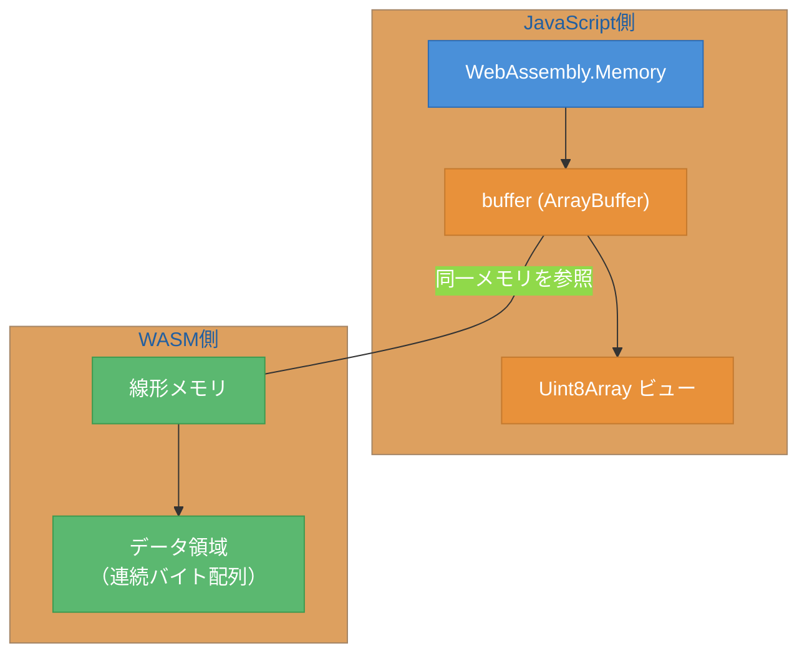
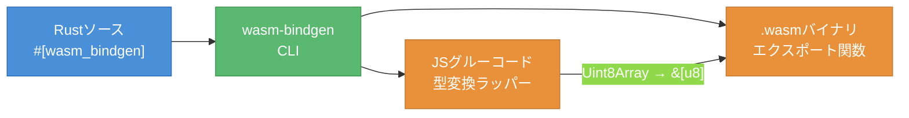
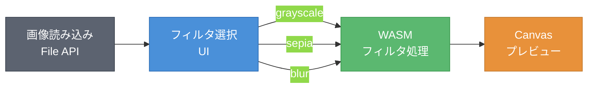
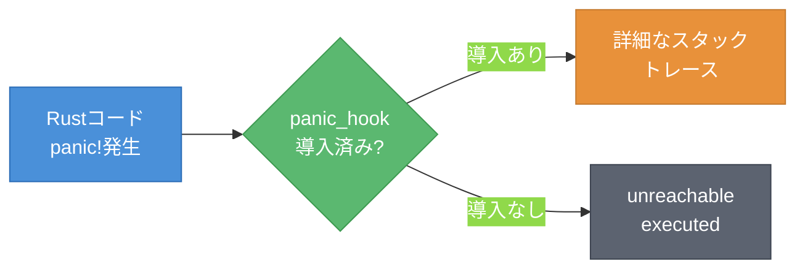

# 第3章 JavaScriptとの連携 ― メモリ共有とフィルタ拡張

第2章では、Rust + wasm-packでグレースケール変換のWASMモジュールを作成した。しかし、データの受け渡しはコピーベースであり、大きな画像ではオーバーヘッドが無視できない。本章では、WASMの線形メモリとJavaScriptのArrayBufferの関係を理解し、サンプルアプリにセピア・ぼかしフィルタを追加する。エラーハンドリングの仕組みも解説する。

---

## 3.1 メモリ共有の仕組み

WASMモジュールは線形メモリ（Linear Memory）と呼ばれる連続したバイト配列を持つ。JavaScript側からは、この線形メモリを`WebAssembly.Memory`オブジェクトの`buffer`プロパティ（ArrayBuffer）としてアクセスできる[^1]。

図3.1に、この関係を示す。



**図3.1: WASM線形メモリとArrayBuffer ― JavaScriptとWASMが同一のメモリ領域を参照する**

wasm-bindgenを使う場合、引数`&[u8]`で受け取るデータはJavaScript側からWASMの線形メモリへコピーされる。戻り値の`Vec<u8>`も同様にコピーが発生する。小さなデータでは問題にならないが、大きな画像データを何度もやりとりする場合はパフォーマンスに影響する。

メモリコピーを避ける方法の一つは、WASMの線形メモリ上に直接データを配置し、JavaScriptからArrayBufferビューでアクセスすることである。ただし、wasm-bindgenが提供する高レベルAPIを使う限り、型変換とメモリ安全性の恩恵を受けられる。本書のサンプルアプリでは、wasm-bindgenの高レベルAPIを使用する方針とする。

---

## 3.2 型変換（Type Conversion）とデータの受け渡し

WASMが直接扱える型は数値型（i32、i64、f32、f64）に限定される[^1]。文字列や配列などの複合型は、線形メモリ上にシリアライズして受け渡す必要がある。wasm-bindgenがこの変換を自動化する。

表3.1に、主要な型の対応を示す。

**表3.1: WASM型とJavaScript型の対応**

| Rust型 | WASM型 | JavaScript型 | 変換方式 |
|--------|--------|-------------|---------|
| `i32`, `u32` | i32 | `number` | 直接渡し |
| `f64` | f64 | `number` | 直接渡し |
| `&str` | ― | `string` | 線形メモリにUTF-8でコピー |
| `String` | ― | `string` | 線形メモリにコピー（所有権移動） |
| `&[u8]` | ― | `Uint8Array` | 線形メモリにコピー |
| `Vec<u8>` | ― | `Uint8Array` | 線形メモリからコピー |
| `JsValue` | ― | `any` | JSオブジェクトの参照 |

図3.2に、wasm-bindgenによるバインディング生成の流れを示す。



**図3.2: wasm-bindgenによるバインディング生成 ― JSグルーコードが型変換を仲介する**

数値型（i32、f64等）はWASMとJavaScript間で直接受け渡しできる。一方、`&[u8]`のようなスライス型は、JSグルーコードがJavaScriptの`Uint8Array`をWASMの線形メモリにコピーし、ポインタと長さをWASM関数に渡す。この仕組みにより、Rust側では標準的な型をそのまま使える。

---

## 3.3 サンプルアプリ: セピア・ぼかしフィルタの追加

サンプルアプリにセピアフィルタとぼかしフィルタを追加する。

### セピアフィルタ

セピアフィルタは、各ピクセルのRGB値に固定の係数行列を掛けることで暖色系の色調に変換する。

```rust
/// セピアフィルタ
/// 暖色系の色調に変換する
#[wasm_bindgen]
pub fn sepia(pixels: &[u8]) -> Vec<u8> {
    let mut output = Vec::with_capacity(pixels.len());

    for chunk in pixels.chunks(4) {
        let r = chunk[0] as f32;
        let g = chunk[1] as f32;
        let b = chunk[2] as f32;
        let a = chunk[3];

        // セピア変換の標準的な係数[^2]
        let new_r = (0.393 * r + 0.769 * g + 0.189 * b).min(255.0) as u8;
        let new_g = (0.349 * r + 0.686 * g + 0.168 * b).min(255.0) as u8;
        let new_b = (0.272 * r + 0.534 * g + 0.131 * b).min(255.0) as u8;

        output.push(new_r);
        output.push(new_g);
        output.push(new_b);
        output.push(a);
    }

    output
}
```

`.min(255.0)`で値を255に制限（クランプ）している。セピア係数は各チャンネルを加算するため、明るいピクセルでは合計値が255を超える可能性がある。

### ぼかしフィルタ

ぼかしフィルタ（ボックスブラー）は、各ピクセルを周囲3x3の平均値で置き換える。グレースケールやセピアと異なり、隣接ピクセルを参照するため画像の幅と高さが必要になる。

```rust
/// ぼかしフィルタ（3x3ボックスブラー）
/// width と height を受け取り、近傍ピクセルの平均値で置き換える
#[wasm_bindgen]
pub fn blur(pixels: &[u8], width: u32, height: u32) -> Vec<u8> {
    let w = width as usize;
    let h = height as usize;
    let mut output = vec![0u8; pixels.len()];

    for y in 0..h {
        for x in 0..w {
            let mut r_sum: u32 = 0;
            let mut g_sum: u32 = 0;
            let mut b_sum: u32 = 0;
            let mut count: u32 = 0;

            // 3x3カーネル
            for dy in -1i32..=1 {
                for dx in -1i32..=1 {
                    let nx = x as i32 + dx;
                    let ny = y as i32 + dy;

                    if nx >= 0 && nx < w as i32 && ny >= 0 && ny < h as i32 {
                        let idx = (ny as usize * w + nx as usize) * 4;
                        r_sum += pixels[idx] as u32;
                        g_sum += pixels[idx + 1] as u32;
                        b_sum += pixels[idx + 2] as u32;
                        count += 1;
                    }
                }
            }

            let idx = (y * w + x) * 4;
            output[idx] = (r_sum / count) as u8;
            output[idx + 1] = (g_sum / count) as u8;
            output[idx + 2] = (b_sum / count) as u8;
            output[idx + 3] = pixels[idx + 3]; // alpha保持
        }
    }

    output
}
```

画像の端では3x3カーネルが画像外にはみ出る。`if`文で境界チェックを行い、範囲外のピクセルを無視する。`count`で有効なピクセル数を数えて平均を取ることで、端のピクセルも自然に処理される。

図3.3に、フィルタ処理パイプラインの全体像を示す。



**図3.3: フィルタ処理パイプライン ― UIでフィルタを選択し、WASMで処理してCanvasに描画する**

JavaScript側では、フィルタ選択UIとCanvas描画を実装する。

```javascript
import init, { grayscale, sepia, blur } from '../rust/pkg/wasm_image_filter.js';

await init();

// フィルタ選択と適用
function applyFilter(filterName, imageData) {
    const pixels = new Uint8Array(imageData.data.buffer);
    let result;

    switch (filterName) {
        case 'grayscale':
            result = grayscale(pixels);
            break;
        case 'sepia':
            result = sepia(pixels);
            break;
        case 'blur':
            result = blur(pixels, imageData.width, imageData.height);
            break;
    }

    return new ImageData(
        new Uint8ClampedArray(result),
        imageData.width,
        imageData.height
    );
}
```

`blur()`は`width`と`height`を追加の引数として受け取る。wasm-bindgenが`u32`をJavaScriptの`number`にそのまま変換する。

---

## 3.4 エラーハンドリング

WASMモジュール内でRustのパニック（`panic!`）が発生すると、デフォルトでは「RuntimeError: unreachable executed」という不親切なエラーメッセージがブラウザコンソールに表示される。`console_error_panic_hook`[^3]を導入することで、パニック発生時にRustのスタックトレースをブラウザコンソールに出力できる。

図3.4に、エラー伝播の流れを示す。



**図3.4: エラー伝播フロー ― panic_hookの有無でエラー情報の詳細度が変わる**

導入方法は以下の通りである。第2章で`Cargo.toml`に追加した`console_error_panic_hook`クレートを、モジュールの初期化時に有効化する。

```rust
use wasm_bindgen::prelude::*;

#[wasm_bindgen(start)]
pub fn init() {
    // WASMモジュール読み込み時に自動実行される
    console_error_panic_hook::set_once();
}
```

`#[wasm_bindgen(start)]`アトリビュートを付けた関数は、WASMモジュールのインスタンス化時に自動的に呼び出される。`set_once()`は最初の1回のみフックを設定し、2回目以降の呼び出しは無視する。

JavaScript側でWASMのエラーをキャッチするには、通常の`try...catch`を使用する。

```javascript
try {
    const result = grayscale(pixels);
} catch (e) {
    // WASMのパニックはRuntimeErrorとしてキャッチされる
    console.error('WASMエラー:', e.message);
}
```

---

フィルタアプリは3種類のフィルタで動作するようになった。しかし、WASMの性能優位性を定量的に評価していない。次章では、同じフィルタ処理をJavaScriptで実装し、WASMとの処理時間を比較する。バッチ処理機能の追加も行い、WASMの適用判断基準を明確にする。

---

## 理解度チェック

### Q1. 線形メモリとArrayBuffer

**種類**: 概念の確認

**難易度**: 基礎

**問題文**:
WASMの線形メモリとJavaScriptのArrayBufferはどのような関係にあるか。

<details>
<summary>解答と解説</summary>

**解答**: WASMの線形メモリは、JavaScript側からは`WebAssembly.Memory`オブジェクトの`buffer`プロパティ（ArrayBuffer）としてアクセスできる。両者は同一のメモリ領域を参照する。

**解説**: 図3.1に示した通り、JavaScriptのArrayBufferとWASMの線形メモリは同じメモリ空間を指している。`Uint8Array`等のTypedArrayビューを通じてJavaScriptからWASMのメモリを直接読み書きできる。

**関連する節**: 3.1節

</details>

---

### Q2. 型変換の仕組み

**種類**: 概念の確認

**難易度**: 基礎

**問題文**:
Rustの`&[u8]`型の引数にJavaScriptから`Uint8Array`を渡す場合、内部で何が起きているか。

<details>
<summary>解答と解説</summary>

**解答**: wasm-bindgenが生成したJSグルーコードが、JavaScriptの`Uint8Array`のデータをWASMの線形メモリにコピーし、ポインタ（メモリ上のオフセット）と長さをWASM関数に渡す。Rust側ではこのポインタと長さから`&[u8]`スライスを構築する。

**解説**: 表3.1に示した通り、`&[u8]`や`Vec<u8>`のような複合型は線形メモリ経由のコピーが必要である。数値型（i32、f64）のみが直接渡しできる。

**関連する節**: 3.2節

</details>

---

### Q3. メモリ戦略の選択

**種類**: 判断問題

**難易度**: 応用

**問題文**:
Webアプリで4K画像（3840x2160、約33MBのRGBAデータ）に対してリアルタイムフィルタを適用する場合、データのコピーと共有メモリのどちらを選ぶべきか。理由も述べよ。

<details>
<summary>解答と解説</summary>

**解答**: 共有メモリ（線形メモリへの直接アクセス）を選ぶべきである。33MBのデータを毎フレームコピーすると、コピーだけで数十ミリ秒を消費し、リアルタイム処理（16ms/フレーム）を達成できない。WASMの線形メモリ上に画像データを直接配置し、JavaScriptからArrayBufferビューでアクセスすることで、コピーのオーバーヘッドを排除できる。

**解説**: 3.1節で述べた通り、wasm-bindgenの高レベルAPIはデータをコピーする。大量データをリアルタイムに処理する場合は、低レベルAPI（`wasm_bindgen::memory()`等）を使って線形メモリに直接アクセスする方が適切である。

**関連する節**: 3.1節

</details>

---

### Q4. フィルタの設計

**種類**: 設計問題

**難易度**: 応用

**問題文**:
サンプルアプリに「エッジ検出フィルタ」を追加する場合、関数シグネチャはどのようになるか。`grayscale`、`sepia`、`blur`のうち、どれを参考にすべきか。理由も述べよ。

<details>
<summary>解答と解説</summary>

**解答**: `blur`を参考にすべきである。エッジ検出はSobelフィルタ等のカーネル処理を使うため、隣接ピクセルを参照する必要がある。したがって`blur`と同様に`width`と`height`を引数に取るシグネチャが必要になる。

```rust
#[wasm_bindgen]
pub fn edge_detect(pixels: &[u8], width: u32, height: u32) -> Vec<u8>
```

`grayscale`や`sepia`は各ピクセルを独立に処理するため幅と高さが不要だが、カーネル処理では画像の2次元構造を知る必要がある。

**関連する節**: 3.3節

</details>

---

## 参考文献

[^1]: MDN Web Docs "WebAssembly.Memory", https://developer.mozilla.org/en-US/docs/WebAssembly/Reference/JavaScript_interface/Memory
[^2]: Microsoft MSDN Image Color Matrix Guide に由来するセピア変換行列。多くの画像処理ライブラリで標準的に使用される係数である。
[^3]: rustwasm/console_error_panic_hook, https://github.com/rustwasm/console_error_panic_hook

- The wasm-bindgen Guide "Supported Types", https://rustwasm.github.io/docs/wasm-bindgen/reference/types.html
