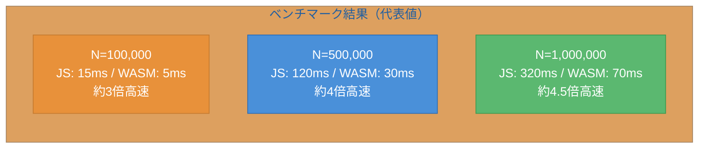
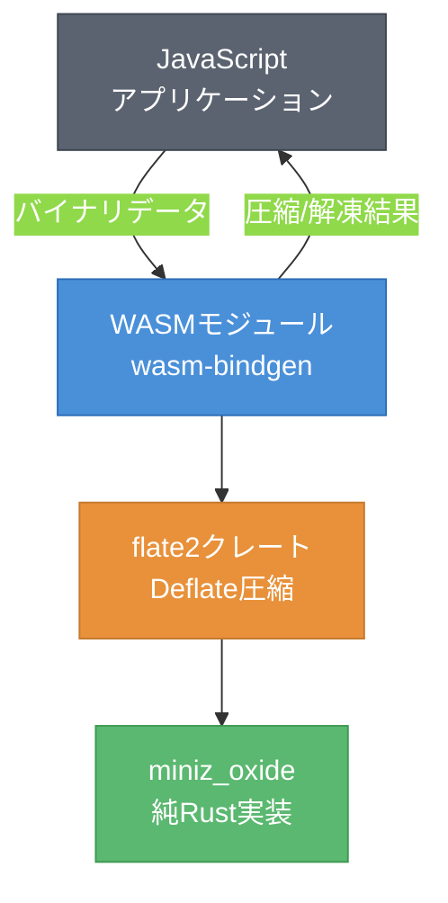
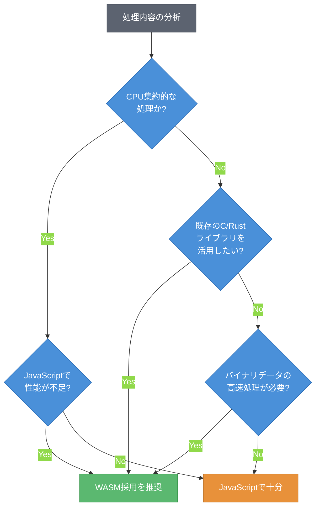

# 第4章 実用ユースケース ― CPU集約処理とバイナリ処理

第3章では、JavaScriptとWASMの連携パターンを学び、画像フィルタ処理を実装した。画像処理以外にも、WASMが真価を発揮する場面は多い。

本章では、素数判定を題材にしたベンチマーク比較、Rustクレートを活用した圧縮処理、そしてWASMの採用判断フレームワークを扱う。「WASMを使うべきか」を自分で判断できる力を養うことが本章の目標である。

## 4.1 CPU集約処理 ― 素数判定とベンチマーク

WASMが最も効果を発揮するのは、CPU集約的な計算処理である。ここでは素数判定を題材に、JavaScriptとWASMの性能差をベンチマークで比較する。

まず、Rust側で素数判定関数を実装する。

```rust
// src/lib.rs - 素数判定
use wasm_bindgen::prelude::*;

/// 指定された上限までの素数の個数を数える（試し割り法）
#[wasm_bindgen]
pub fn count_primes(limit: u32) -> u32 {
    let mut count = 0;
    for n in 2..=limit {
        if is_prime(n) {
            count += 1;
        }
    }
    count
}

fn is_prime(n: u32) -> bool {
    if n < 2 { return false; }
    if n < 4 { return true; }
    if n % 2 == 0 || n % 3 == 0 { return false; }
    let mut i = 5;
    while i * i <= n {
        if n % i == 0 || n % (i + 2) == 0 {
            return false;
        }
        i += 6;
    }
    true
}
```

コード4.1: Rustによる素数判定のWASM実装

同等のロジックをJavaScriptでも実装する。

```javascript
// JavaScriptによる素数判定（比較用）
function countPrimesJS(limit) {
    let count = 0;
    for (let n = 2; n <= limit; n++) {
        if (isPrime(n)) count++;
    }
    return count;
}

function isPrime(n) {
    if (n < 2) return false;
    if (n < 4) return true;
    if (n % 2 === 0 || n % 3 === 0) return false;
    for (let i = 5; i * i <= n; i += 6) {
        if (n % i === 0 || n % (i + 2) === 0) return false;
    }
    return true;
}
```

コード4.2: JavaScriptによる素数判定（比較用）

次に、両者のベンチマークを計測する。

```javascript
// ベンチマーク計測
import init, { count_primes } from './pkg/prime_counter.js';

async function benchmark() {
    await init();
    const limits = [100_000, 500_000, 1_000_000];

    for (const limit of limits) {
        // JavaScript版の計測
        const jsStart = performance.now();
        const jsResult = countPrimesJS(limit);
        const jsTime = performance.now() - jsStart;

        // WASM版の計測
        const wasmStart = performance.now();
        const wasmResult = count_primes(limit);
        const wasmTime = performance.now() - wasmStart;

        console.log(`N=${limit.toLocaleString()}`);
        console.log(`  JS:   ${jsTime.toFixed(1)}ms (${jsResult}個)`);
        console.log(`  WASM: ${wasmTime.toFixed(1)}ms (${wasmResult}個)`);
        console.log(`  倍率: ${(jsTime / wasmTime).toFixed(1)}x`);
    }
}
```

コード4.3: ベンチマーク計測コード

図4.1に、典型的なベンチマーク結果を示す。



図4.1: JavaScript vs WASM ― CPU集約処理のベンチマーク結果（代表値）[^1]

[^1]: ベンチマーク結果は実行環境により変動する。代表値はChrome 120、M1 MacBook Proでの計測に基づく。

計算量が増えるほどWASMの優位性が大きくなる傾向がある。これはWASMが事前にコンパイルされた型付きバイトコードであり、JavaScriptのように実行時の型推論や最適化が不要なためである。

表4.1に、WASMが有効なユースケースを分類する。

| カテゴリ | 具体例 | WASMの優位性 |
|---------|--------|-------------|
| 数値計算 | 素数判定、行列演算、物理シミュレーション | 整数・浮動小数点演算が高速 |
| バイナリ処理 | 圧縮・解凍、暗号化、画像変換 | バイト列操作が効率的 |
| 既存ライブラリ活用 | Rustクレート、C/C++ライブラリの再利用 | ブラウザ向けに移植不要 |
| リアルタイム処理 | オーディオ処理、動画エンコード | 安定した低レイテンシ |

表4.1: WASMが有効なユースケースの分類

一方、DOM操作が中心のUI処理やネットワークI/O待ちが多い処理では、WASMの性能優位性はほとんど現れない。JS-WASM間の呼び出しにはオーバーヘッドがあるため、細かい関数呼び出しを頻繁に行うケースではむしろ性能が低下する可能性がある。

## 4.2 バイナリデータ処理 ― 圧縮・解凍

WASMのもう一つの強力なユースケースが、既存のRustエコシステムの活用である。ここでは、Rustの`flate2`クレートをWASMにコンパイルし、ブラウザ上でのデータ圧縮・解凍を実装する。図4.2に、このアーキテクチャを示す。



図4.2: バイナリ処理のアーキテクチャ ― Rustライブラリの再利用パターン

`flate2`クレートは内部で`miniz_oxide`（純Rust実装のDeflate）を使用するため、C言語の依存なくWASMにコンパイルできる。このように、純Rustで書かれたクレートはそのままWASMターゲットで利用できることが多い。

```rust
// Cargo.toml
// [dependencies]
// wasm-bindgen = "0.2"
// flate2 = "1.0"

use wasm_bindgen::prelude::*;
use flate2::write::{DeflateEncoder, DeflateDecoder};
use flate2::Compression;
use std::io::Write;

/// データをDeflate圧縮する
#[wasm_bindgen]
pub fn compress(data: Vec<u8>) -> Vec<u8> {
    let mut encoder = DeflateEncoder::new(
        Vec::new(),
        Compression::default()
    );
    encoder.write_all(&data).unwrap();
    encoder.finish().unwrap()
}

/// Deflate圧縮されたデータを解凍する
#[wasm_bindgen]
pub fn decompress(data: Vec<u8>) -> Vec<u8> {
    let mut decoder = DeflateDecoder::new(Vec::new());
    decoder.write_all(&data).unwrap();
    decoder.finish().unwrap()
}
```

コード4.4: Rustクレートを活用した圧縮・解凍

このコードでは、`flate2`クレートの`DeflateEncoder`と`DeflateDecoder`をそのまま使用している。wasm-bindgenの`Vec<u8>`受け渡しにより、JavaScript側からはシンプルな関数呼び出しで圧縮・解凍を利用できる。

ブラウザにはCompressionStreams APIという標準の圧縮APIも存在する[^2]。しかし、WASMによる実装には以下の利点がある。

[^2]: CompressionStreams API は2023年時点で主要ブラウザ（Chrome 80+、Firefox 113+、Safari 16.4+）でサポートされている。MDN "Compression Streams API", https://developer.mozilla.org/en-US/docs/Web/API/Compression_Streams_API を参照。

- **アルゴリズムの選択肢**: ブラウザAPIはgzip/deflate/deflate-rawに限定されるが、WASMなら任意のアルゴリズムを実装できる
- **処理の制御**: 圧縮レベルの細かな調整やカスタムフィルタの適用が可能
- **既存コードの再利用**: Rustエコシステムの成熟したライブラリをそのまま活用できる

## 4.3 判断フレームワーク ― WASMを使うべきか

これまでの実装経験を踏まえ、WASMの採用判断フレームワークを提示する。図4.3に、判断のフローチャートを示す。



図4.3: WASM採用判断フローチャート

判断の要点は三つである。

**第一に、処理の性質を見極める。** CPU集約的な処理（数値計算、画像・音声処理、暗号化等）ではWASMの性能優位性が明確に現れる。一方、DOM操作やネットワーク通信が中心の処理では効果が薄い。

**第二に、既存資産を活用できるかを検討する。** C/C++やRustで書かれた成熟したライブラリが存在する場合、WASMを通じてブラウザ上で再利用できる。JavaScriptで同等の実装をゼロから書くよりも、品質と開発速度の両面で有利になることが多い。

**第三に、導入コストを考慮する。** WASMの導入には、ツールチェーンの整備（wasm-pack等）、ビルドパイプラインの構築、デバッグ環境の準備が必要である。小規模な処理やプロトタイプ段階では、JavaScriptでの実装が合理的な場合もある。

本章では、CPU集約処理でのベンチマーク比較と、Rustクレートを活用したバイナリ処理を通じて、WASMの実用的なユースケースを学んだ。さらに、採用判断フレームワークにより「WASMを使うべきか否か」を体系的に判断する方法を示した。次の第5章では、本番環境へのデプロイに必要なステップを扱う。バイナリサイズの最適化とKubernetesでのWASM実行がテーマである。

## 参考文献

- MDN "Compression Streams API", https://developer.mozilla.org/en-US/docs/Web/API/Compression_Streams_API
- flate2 crate documentation, https://docs.rs/flate2/
- Lin Clark "Standardizing WASI: A system interface to run WebAssembly outside the web" (2019), Mozilla Hacks, https://hacks.mozilla.org/2019/03/standardizing-wasi-a-webassembly-system-interface/

## 理解度チェック

### Q1. WASMが有効なユースケース

**種類**: 判断問題

**難易度**: 基礎

**問題文**:
以下のユースケースのうち、WASMの導入が最も効果的なものはどれか。

**選択肢**:
- (a) ボタンクリック時のDOM要素の表示切り替え
- (b) REST APIからのJSONデータ取得と表示
- (c) ブラウザ上での大量の画像のリアルタイムフィルタ処理
- (d) フォーム入力値のバリデーション

<details>
<summary>解答と解説</summary>

**解答**: (c)

**解説**: 画像のリアルタイムフィルタ処理はCPU集約的な処理であり、WASMの性能優位性が最も発揮される。(a)と(d)はDOM操作中心の軽量な処理であり、JavaScriptで十分である。(b)はネットワークI/O待ちが主であり、WASMの恩恵は小さい。

**関連する節**: 4.1節、4.3節

</details>

---

### Q2. Rustクレートの再利用

**種類**: 概念の確認

**難易度**: 基礎

**問題文**:
既存のRustクレートをWASMで再利用する際に、クレートが満たすべき条件と注意点を説明せよ。

<details>
<summary>解答と解説</summary>

**解答**: WASMで再利用するには、クレートが純Rustで実装されていること（C言語への依存がないこと）が重要である。`flate2`が内部で`miniz_oxide`（純Rust実装）を使用するように、WASMターゲットではCのシステムライブラリにリンクできないためである。また、ファイルシステムやネットワーク等のOS機能を直接使用するクレートはブラウザ環境では動作しない。WASI対応のランタイムであればこれらの制約は緩和される。

**解説**: Rustエコシステムの活用はWASMの大きな利点の一つであるが、全てのクレートがそのまま使えるわけではない。依存関係の確認が必要である。

**関連する節**: 4.2節

</details>

---

### Q3. WASM導入の判断

**種類**: 設計問題

**難易度**: 応用

**問題文**:
あなたはWebアプリケーションの開発チームに所属している。以下の要件を持つ機能を実装することになった。WASMを採用すべきか判断し、理由を述べよ。

要件: ユーザーがアップロードしたCSVファイル（最大50MB）をブラウザ上で解析し、統計情報（平均、中央値、標準偏差等）を計算して表示する。

<details>
<summary>解答と解説</summary>

**解答**: WASM採用を推奨する。理由は以下の通りである。(1) 50MBのCSVデータの解析は数値計算が中心のCPU集約処理であり、WASMの性能優位性が活きる。(2) Rustには`csv`クレートや統計計算ライブラリが存在し、再利用できる。(3) バイナリデータ（CSVのバイト列）の効率的な処理は第3章で学んだ線形メモリの仕組みで実現できる。ただし、ファイルのアップロードやUIの表示はJavaScriptで実装し、計算処理部分のみをWASMに委譲する設計が適切である。

**解説**: 4.3節の判断フレームワークに沿って評価すると、CPU集約的な処理であり、かつ既存のRustライブラリを活用できるため、WASMの採用が合理的である。

**関連する節**: 4.1節、4.2節、4.3節

</details>
