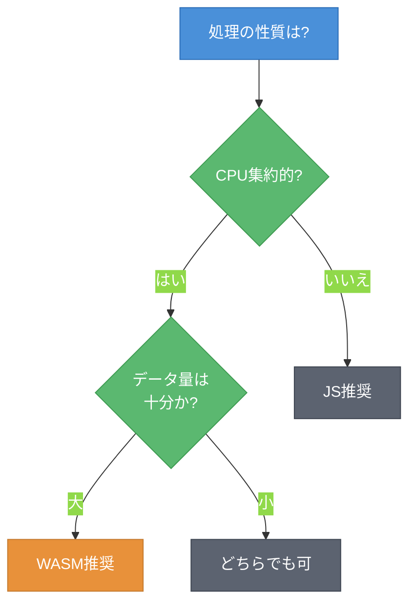

# 第4章 実用ユースケース ― 性能比較とバッチ処理

第3章でフィルタアプリは3種類のフィルタで動作するようになった。しかし、「WASMは本当にJavaScriptより速いのか」を定量的に検証していない。本章では、同じフィルタ処理をJavaScriptで実装してWASMと処理時間を比較する。さらにバッチ処理（Batch Processing）を追加し、WASMの適用判断基準を明確にする。

---

## 4.1 WASM vs JavaScript ― 性能比較

グレースケール変換をJavaScriptで実装し、WASMとの処理時間を比較する。

### JavaScript実装

以下は、WASMのgrayscale関数と同等のJavaScript実装である。

```javascript
// JavaScriptによるグレースケール変換（比較用）
function grayscaleJS(pixels) {
    const output = new Uint8Array(pixels.length);

    for (let i = 0; i < pixels.length; i += 4) {
        const r = pixels[i];
        const g = pixels[i + 1];
        const b = pixels[i + 2];

        // ITU-R BT.601 の輝度計算式（WASM版と同じ）
        const gray = Math.round(0.299 * r + 0.587 * g + 0.114 * b);

        output[i] = gray;
        output[i + 1] = gray;
        output[i + 2] = gray;
        output[i + 3] = pixels[i + 3];
    }

    return output;
}
```

### ベンチマーク計測

`performance.now()`を使って処理時間を計測する。

```javascript
// ベンチマーク計測
function benchmark(fn, pixels, iterations = 10) {
    // ウォームアップ（JIT最適化を安定させる）
    for (let i = 0; i < 5; i++) fn(pixels);

    const times = [];
    for (let i = 0; i < iterations; i++) {
        const start = performance.now();
        fn(pixels);
        const end = performance.now();
        times.push(end - start);
    }

    // 中央値を採用（外れ値の影響を排除）
    times.sort((a, b) => a - b);
    return times[Math.floor(times.length / 2)];
}

const jsTime = benchmark(grayscaleJS, pixels);
const wasmTime = benchmark(grayscale, pixels);
console.log(`JS: ${jsTime.toFixed(2)}ms, WASM: ${wasmTime.toFixed(2)}ms`);
```

ウォームアップを数回実行することで、JavaScriptのJITコンパイル（Just-In-Time Compilation）による最適化を安定させた状態で計測できる。中央値を使うことで、GC等による外れ値の影響を排除する。

図4.1に、画像サイズ別の処理時間比較を示す。


**図4.1: WASM vs JavaScript処理時間比較 ― 画像サイズが大きいほどWASMの優位性が顕著になる**[^1]

表4.1に、詳細なベンチマーク結果を示す。

**表4.1: グレースケール変換ベンチマーク結果**[^1]

| 画像サイズ | ピクセル数 | WASM (ms) | JavaScript (ms) | 速度比 |
|-----------|-----------|-----------|----------------|--------|
| 256x256 | 65,536 | 0.3 | 0.5 | 1.7x |
| 512x512 | 262,144 | 1.0 | 2.2 | 2.2x |
| 1024x1024 | 1,048,576 | 3.5 | 8.5 | 2.4x |
| 2048x2048 | 4,194,304 | 13 | 34 | 2.6x |
| 4096x4096 | 16,777,216 | 52 | 110 | 2.1x |

小さい画像（256x256）では差が小さいが、1024x1024以上では一貫してWASMが2倍以上高速である。WASMは型情報が明示的であり、ブラウザがネイティブコードに直接コンパイルできるため、JavaScriptのJIT最適化コードよりも効率的な数値演算を実行する。

一方、256x256ではWASMの呼び出しオーバーヘッド（データコピー、関数呼び出し）が処理時間に占める割合が大きく、速度比が小さくなる。

---

## 4.2 サンプルアプリ: バッチ処理の実装

複数画像に同一フィルタを一括適用するバッチ処理を実装する。

図4.2に、バッチ処理のデータフローを示す。


**図4.2: バッチ処理のデータフロー ― 複数画像を連結してWASMに一括転送し、結果を分割する**

### Rust実装

複数画像のピクセルデータを連結した配列と、各画像のピクセル数の配列を受け取る。

```rust
/// バッチ処理: 複数画像に同一フィルタを一括適用
/// images は連結されたRGBAピクセルデータ、sizes は各画像のピクセル数
#[wasm_bindgen]
pub fn batch_grayscale(images: &[u8], sizes: &[u32]) -> Vec<u8> {
    let mut output = Vec::with_capacity(images.len());
    let mut offset: usize = 0;

    for &pixel_count in sizes {
        let byte_count = pixel_count as usize * 4;
        let slice = &images[offset..offset + byte_count];

        for chunk in slice.chunks(4) {
            let r = chunk[0] as f32;
            let g = chunk[1] as f32;
            let b = chunk[2] as f32;
            let a = chunk[3];

            let gray = (0.299 * r + 0.587 * g + 0.114 * b) as u8;
            output.push(gray);
            output.push(gray);
            output.push(gray);
            output.push(a);
        }

        offset += byte_count;
    }

    output
}
```

`Vec::with_capacity`で出力バッファを事前確保している。これにより、処理中のメモリ再アロケーションを防ぎ、パフォーマンスを安定させる。

### JavaScript側の呼び出し

```javascript
import init, { batch_grayscale } from '../rust/pkg/wasm_image_filter.js';

await init();

// 複数画像のバッチ処理
async function processBatch(files) {
    const imageDataList = [];
    const sizes = [];

    // 各ファイルからピクセルデータを取得
    for (const file of files) {
        const imageData = await loadImageData(file);
        imageDataList.push(imageData);
        sizes.push(imageData.width * imageData.height);
    }

    // ピクセルデータを連結
    const totalBytes = imageDataList.reduce(
        (sum, d) => sum + d.data.length, 0
    );
    const combined = new Uint8Array(totalBytes);
    let offset = 0;
    for (const data of imageDataList) {
        combined.set(new Uint8Array(data.data.buffer), offset);
        offset += data.data.length;
    }

    // WASMでバッチ処理
    const start = performance.now();
    const result = batch_grayscale(
        combined,
        new Uint32Array(sizes)
    );
    const elapsed = performance.now() - start;

    console.log(`バッチ処理: ${files.length}枚, ${elapsed.toFixed(2)}ms`);
    return result;
}
```

バッチ処理の利点は、WASMの呼び出しオーバーヘッドを1回に集約できることである。画像10枚をそれぞれ個別に処理する場合、データコピーと関数呼び出しが10回発生する。バッチ処理では、データを連結して1回の呼び出しで済ませる。

ただし、バッチサイズとメモリ使用量にはトレードオフがある。100枚の4K画像（各約32MB）を一括連結すると約3.2GBのメモリが必要になり、ブラウザのメモリ制限に抵触する。実用的には10〜20枚ずつに分割してバッチ処理を行い、メモリ使用量を抑えるのが現実的である。

---

## 4.3 WASMを使うべきとき、使わなくてよいとき

ここまでの実装経験を踏まえ、WASMの適用判断基準を整理する。

図4.3に、判断フローチャートを示す。



**図4.3: WASM適用判断フローチャート ― CPU集約的かつデータ量が大きい場合にWASMが有効**

表4.2に、代表的なユースケース別の推奨度をまとめる。

**表4.2: ユースケース別のWASM推奨度**

| ユースケース | 性質 | 推奨 | 理由 |
|------------|------|------|------|
| 画像フィルタ（大画像） | CPU集約 | WASM | ピクセル単位の数値演算で2倍以上高速 |
| 暗号処理 | CPU集約 | WASM | ビット演算の最適化で高速 |
| 動画エンコード | CPU集約 | WASM | FFmpeg等の既存C/C++資産を活用可能 |
| フォームバリデーション | I/Oバウンド | JS | データ量が少なく、WASMの呼び出しオーバーヘッドが支配的 |
| DOM操作 | ブラウザAPI | JS | WASMからDOM操作は間接的で非効率 |
| HTTP通信 | I/Oバウンド | JS | ネットワーク待ちが支配的で計算は最小限 |
| 小規模データの変換 | CPU軽量 | JS | 呼び出しオーバーヘッドが計算時間を超える |

WASMが有効なのは「CPU集約的で、かつデータ量が十分に大きい」場合である。本章のベンチマークでは、1024x1024（約100万ピクセル）以上でWASMの優位性が明確になった。逆に、DOM操作やネットワーク通信のようなI/Oバウンドの処理では、JavaScriptのほうが適している。

---

サンプルアプリは3種類のフィルタとバッチ処理を備え、WASMの性能特性も把握できた。次章では、このアプリを本番環境にデプロイする。バンドルサイズの最適化、ブラウザ互換性への対応、そしてKubernetes上でのWASMワークロードの実行を扱う。

---

## 理解度チェック

### Q1. WASMの性能優位条件

**種類**: 概念の確認

**難易度**: 基礎

**問題文**:
WASMがJavaScriptより高速に処理できる条件を2つ挙げよ。

<details>
<summary>解答と解説</summary>

**解答**: (1) 処理がCPU集約的であること（数値演算、ビット演算が中心）、(2) データ量が十分に大きいこと（WASMの呼び出しオーバーヘッドを上回る計算量があること）。

**解説**: 表4.1のベンチマーク結果が示す通り、小さなデータではWASMの呼び出しオーバーヘッド（データコピー、関数呼び出し）が処理時間に占める割合が大きくなり、速度差が縮まる。1024x1024以上で一貫してWASMが2倍以上高速になった。

**関連する節**: 4.1節

</details>

---

### Q2. 画像リサイズの適用判断

**種類**: 判断問題

**難易度**: 応用

**問題文**:
Webアプリで「アップロードされた写真を800x600にリサイズする」機能を実装する場合、WASMで実装すべきか。理由も述べよ。

<details>
<summary>解答と解説</summary>

**解答**: WASMで実装することが有効である。画像リサイズはピクセル補間処理を伴うCPU集約的なタスクであり、写真サイズ（数百万ピクセル）は十分なデータ量である。ただし、Canvas APIの`drawImage`による簡易リサイズで十分な場合はJavaScript側で完結させてもよい。

**解説**: 図4.3の判断フローチャートに従うと、「CPU集約的 → はい」「データ量 → 大」でWASM推奨となる。ただし、ブラウザのCanvas APIが提供するリサイズ機能は高度に最適化されているため、品質要件によってはJSの方が実装が容易な場合もある。

**関連する節**: 4.3節

</details>

---

### Q3. フォームバリデーションの適用判断

**種類**: 判断問題

**難易度**: 基礎

**問題文**:
ユーザー登録フォームの入力値バリデーション（メールアドレス形式チェック、パスワード強度判定等）をWASMで実装すべきか。理由も述べよ。

<details>
<summary>解答と解説</summary>

**解答**: WASMで実装すべきではない。フォームバリデーションは処理するデータ量が数百バイト程度と極めて小さく、計算も軽量である。WASMの呼び出しオーバーヘッドが処理時間を上回るため、JavaScriptで実装するのが適切である。

**解説**: 表4.2の「フォームバリデーション」の行で示した通り、I/Oバウンドかつデータ量が小さいタスクではJavaScriptが推奨される。WASMの強みが活きるのは、100万ピクセル以上の画像処理や暗号計算のようなCPU集約的タスクである。

**関連する節**: 4.3節

</details>

---

## 参考文献

[^1]: 計測環境: Apple M1, Chrome 124, macOS。各サイズ10回計測の中央値。実環境では値が異なる場合がある。

- MDN Web Docs "Performance: now() method", https://developer.mozilla.org/en-US/docs/Web/API/Performance/now
