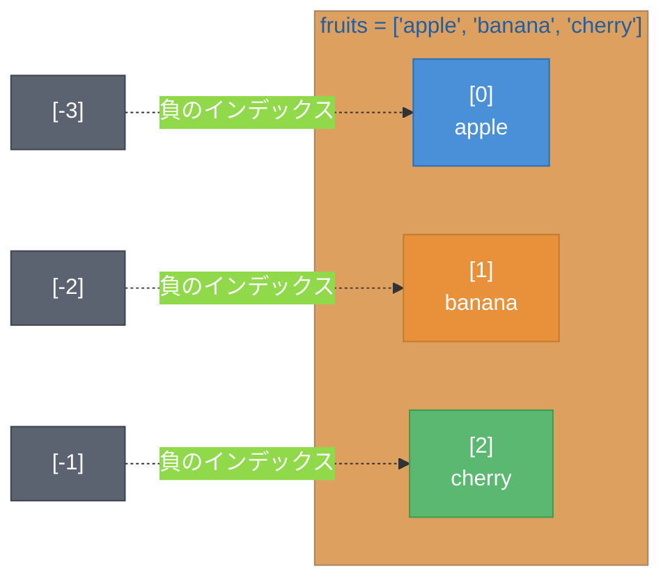
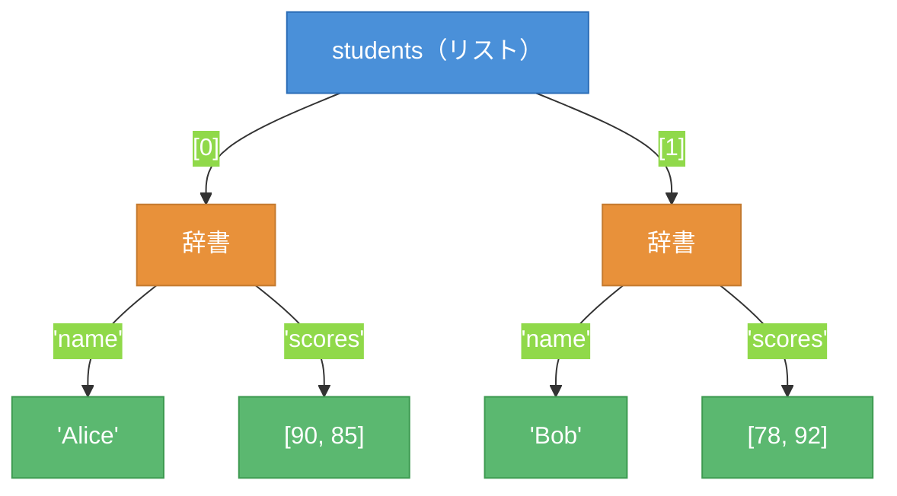

# 第4章 データ構造 ― データをまとめて管理する

第3章では、`for`ループで複数のデータを繰り返し処理する方法を学んだ。本章では、複数のデータをまとめて管理するための「入れ物」であるデータ構造を学ぶ。リスト（List）、タプル（Tuple）、辞書（Dictionary）の三つを扱う。

## 4.1 リスト

リストは、順序を持つ変更可能なコレクション（Collection）である。コレクションとは複数のデータをまとめて管理する入れ物のことである。リストは変更可能（ミュータブル（Mutable））であり、角括弧`[]`で作成する。図4.1にリストの構造とインデックス（Index）の対応を示す。



**図4.1: リストの構造とインデックスの対応**

インデックスは0から始まる。負のインデックスを使うと末尾からアクセスできる。

```python
# リストの作成とアクセス
fruits = ["apple", "banana", "cherry"]
print(fruits[0])    # apple（先頭）
print(fruits[-1])   # cherry（末尾）
```

ミュータブルなリストは、要素の追加・削除・変更ができる。

```python
# リストの操作
fruits = ["apple", "banana", "cherry"]
fruits.append("date")      # 末尾に追加
fruits[1] = "blueberry"    # 要素の変更
fruits.remove("cherry")    # 要素の削除
print(fruits)   # ['apple', 'blueberry', 'date']
print(len(fruits))  # 3（要素数）
```

`append()`で末尾に追加、`remove()`で指定した値を削除する。`len()`関数で要素数を取得できる。

スライス（Slice）を使うと、リストの一部を範囲指定で取得できる。

```python
# スライスの使用例
numbers = [0, 1, 2, 3, 4, 5]
print(numbers[1:4])   # [1, 2, 3]（インデックス1から3まで）
print(numbers[:3])    # [0, 1, 2]（先頭から3つ）
print(numbers[3:])    # [3, 4, 5]（インデックス3から末尾）
```

## 4.2 タプルと辞書

### タプル

タプルは、順序を持つ変更不可能（イミュータブル（Immutable））なコレクションである。丸括弧`()`で作成する。

```python
# タプルの作成
point = (10, 20)
print(point[0])   # 10
# point[0] = 30   # エラー: タプルは変更できない
```

タプルは一度作成したら要素を変更できない。座標やRGB値のように、変更されるべきでないデータの組に適している。

### 辞書

辞書は、キーと値のペアを格納するコレクションである。波括弧`{}`で作成する。

```python
# 辞書の作成とアクセス
user = {"name": "Alice", "age": 25, "city": "Tokyo"}
print(user["name"])    # Alice
user["age"] = 26       # 値の更新
user["email"] = "alice@example.com"  # 新しいキーの追加
print(user)
# {'name': 'Alice', 'age': 26, 'city': 'Tokyo', 'email': 'alice@example.com'}
```

表4.1に、三つのデータ構造の特徴をまとめる。

**表4.1: リスト・タプル・辞書の比較**

| 特徴 | リスト `[]` | タプル `()` | 辞書 `{}` |
|------|------------|------------|----------|
| 順序 | あり | あり | あり（Python 3.7以降） |
| 変更 | 可能 | 不可能 | 可能 |
| アクセス | インデックス | インデックス | キー |
| 用途 | 可変長のデータ集合 | 固定のデータの組 | キーと値の対応 |

## 4.3 データ構造の操作

### リスト内包表記

リスト内包表記（List Comprehension）を使うと、簡潔にリストを生成できる。

```python
# リスト内包表記
squares = [x ** 2 for x in range(5)]
print(squares)  # [0, 1, 4, 9, 16]

# 条件付きリスト内包表記
evens = [x for x in range(10) if x % 2 == 0]
print(evens)  # [0, 2, 4, 6, 8]
```

`[式 for 変数 in イテラブル]`の形式で、ループと同等の処理を1行で記述できる。

### 辞書の反復処理

`items()`メソッドを使うと、辞書のキーと値を同時に取得できる。

```python
# 辞書の反復処理
scores = {"math": 90, "english": 85, "science": 92}
for subject, score in scores.items():
    print(f"{subject}: {score}")
# 出力: math: 90, english: 85, science: 92
```

### ネストしたデータ構造

データ構造はネストして複雑なデータを表現できる。図4.2にネストしたデータ構造のイメージを示す。



**図4.2: ネストしたデータ構造のイメージ**

```python
# ネストしたデータ構造
students = [
    {"name": "Alice", "scores": [90, 85]},
    {"name": "Bob", "scores": [78, 92]},
]

for student in students:
    avg = sum(student["scores"]) / len(student["scores"])
    print(f"{student['name']}: 平均 {avg}")
# 出力: Alice: 平均 87.5, Bob: 平均 85.0
```

リストの中に辞書、辞書の中にリストを格納することで、構造化されたデータを表現できる。

---

本章では、リスト・タプル・辞書の三つのデータ構造を学んだ。データをまとめて管理できるようになったが、データに対する処理もまとめたい場面がある。次の第5章では、処理を関数として定義し、再利用可能にする方法を学ぶ。

---

## 理解度チェック

### Q1. リストとタプルの違い

**種類**: 概念の確認

**難易度**: 基礎

**問題文**:
リストとタプルの違いを説明し、それぞれが適切な使用場面を述べよ。

<details>
<summary>解答と解説</summary>

**解答**: リストは変更可能（ミュータブル）で、要素の追加・削除・変更ができる。タプルは変更不可能（イミュータブル）で、作成後に要素を変更できない。リストは可変長のデータ集合（買い物リスト等）に適し、タプルは固定のデータの組（座標、RGB値等）に適している。

**解説**: 変更不可能であるタプルは、意図しない変更を防げるため安全性が高い。データが変更されるべきでない場合はタプルを選択する。

**関連する節**: 4.1節、4.2節

</details>

---

### Q2. データ構造の選択

**種類**: 判断問題

**難易度**: 基礎

**問題文**:
以下のデータを管理するのに最も適切なデータ構造を選べ。

1. ユーザーの名前、年齢、メールアドレス
2. テストの点数一覧（後から追加あり）
3. 緯度と経度のペア

**選択肢**:
- (a) 1: 辞書、2: リスト、3: タプル
- (b) 1: リスト、2: タプル、3: 辞書
- (c) 1: タプル、2: リスト、3: 辞書
- (d) 1: 辞書、2: タプル、3: リスト

<details>
<summary>解答と解説</summary>

**解答**: (a)

**解説**: 場面1はキーと値の対応（名前→"Alice"等）であり辞書が適切である。場面2は後から追加が必要な可変長データであり、リストが適切である。場面3は固定の二つの値の組であり、変更不可能なタプルが適切である。

**関連する節**: 4.2節

</details>

---

### Q3. 単語の出現回数カウント

**種類**: 設計問題

**難易度**: 応用

**問題文**:
以下の単語リストから、各単語の出現回数をカウントして辞書で返すコードを書け。

```python
words = ["apple", "banana", "apple", "cherry", "banana", "apple"]
```

<details>
<summary>解答と解説</summary>

**解答**:
```python
words = ["apple", "banana", "apple", "cherry", "banana", "apple"]
count = {}
for word in words:
    if word in count:
        count[word] += 1
    else:
        count[word] = 1
print(count)  # {'apple': 3, 'banana': 2, 'cherry': 1}
```

**解説**: 辞書を使い、各単語をキー、出現回数を値として管理する。`word in count`でキーの存在を確認し、存在すればカウントを増やし、存在しなければ初期値1を設定する。`for`ループと辞書の操作を組み合わせた実践的なパターンである。

**関連する節**: 4.2節、4.3節

</details>
