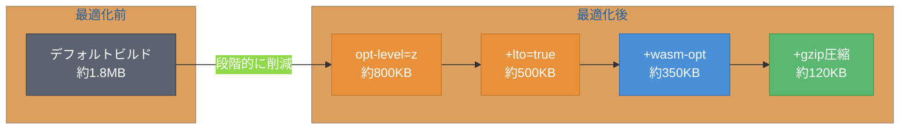
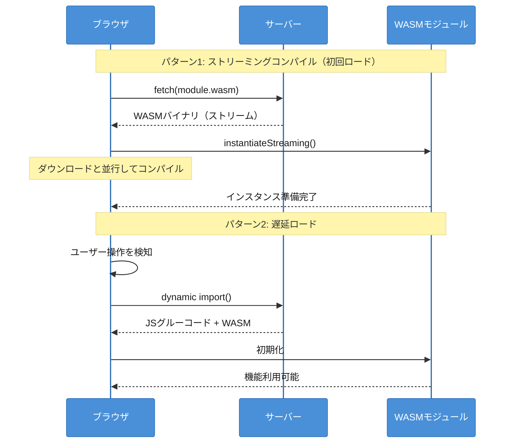
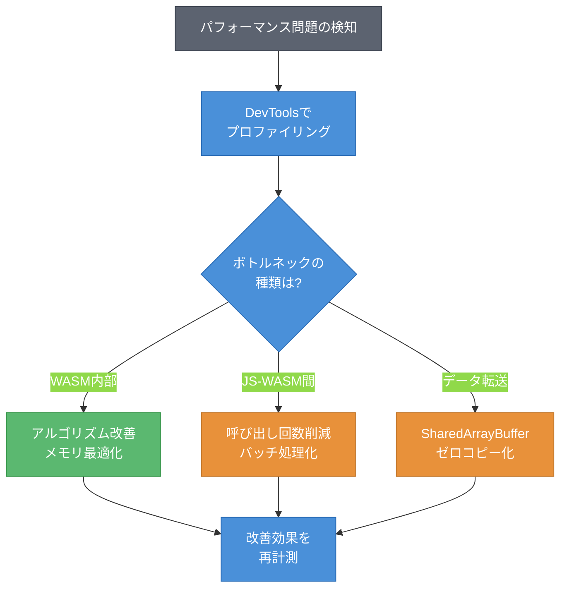
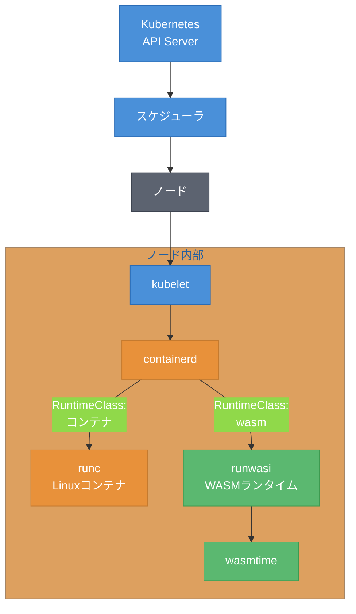
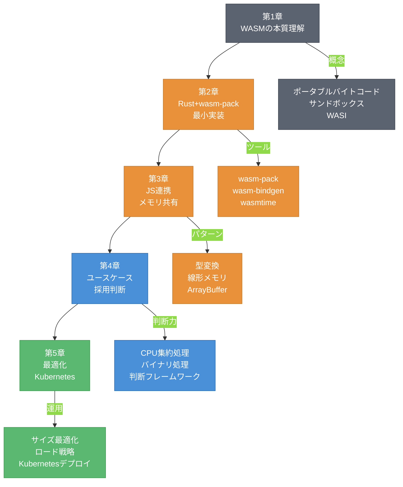

# 第5章 本番環境への道 ― 最適化とKubernetesデプロイ

第4章では、WASMの実用的なユースケースと採用判断フレームワークを学んだ。開発環境で動くコードを本番環境にデプロイするには、さらにいくつかのステップが必要である。

本章では、WASMバイナリのサイズ最適化、ブラウザでのロード戦略、パフォーマンス分析手法を解説する。さらに、KubernetesでWASMワークロードを実行する方法を示し、最後に本書の内容を振り返る。

## 5.1 バンドルサイズ最適化

WASMバイナリのサイズは、ユーザー体験に直結する。特にモバイル環境では、バイナリサイズがロード時間に大きく影響する。ここでは、主要な最適化手法を紹介する。

コード5.1に、最適化設定を含む`Cargo.toml`の例を示す。

```toml
# Cargo.toml - WASMバイナリの最適化設定
[package]
name = "optimized-wasm"
version = "0.1.0"
edition = "2021"

[lib]
crate-type = ["cdylib"]

[dependencies]
wasm-bindgen = "0.2"

[profile.release]
# サイズ最適化（速度よりサイズを優先）
opt-level = "z"
# リンク時最適化（ビルド時間は増加するが、サイズ削減効果大）
lto = true
# コード生成ユニットを1つに統合（最適化の機会を増やす）
codegen-units = 1
# パニック時にabortする（unwind用コードを削除）
panic = "abort"
# デバッグ情報とシンボルを除去
strip = true
```

コード5.1: 最適化設定を含むCargo.toml

各設定の効果を図5.1に示す。



図5.1: 最適化手法ごとのバイナリサイズ削減効果（代表値）[^1]

[^1]: サイズはプロジェクトの依存クレート数やコード量により大きく変動する。代表値は中規模のWASMプロジェクト（wasm-bindgen + flate2程度）での計測に基づく。

`Cargo.toml`の設定に加え、`wasm-opt`による後処理も有効である。`wasm-opt`はBinaryen[^2]に含まれるツールで、WASMバイナリに対して追加の最適化を適用する。

[^2]: Binaryenは、WebAssemblyのためのコンパイラインフラストラクチャである。https://github.com/WebAssembly/binaryen を参照。

```bash
# wasm-optによる後処理（wasm-packを使う場合は自動実行される）
wasm-opt -Oz -o output.wasm input.wasm
```

表5.1に、主要な最適化オプションとその効果をまとめる。

| オプション | 設定 | 効果 | トレードオフ |
|-----------|------|------|-------------|
| opt-level | `"z"` | サイズ最小化 | 実行速度がやや低下 |
| lto | `true` | クレート間最適化 | ビルド時間が増加 |
| codegen-units | `1` | 最適化機会の増加 | ビルド時間が増加 |
| panic | `"abort"` | unwindコード除去 | パニック時のスタックトレースなし |
| strip | `true` | デバッグ情報・シンボル除去 | デバッグが困難に |
| wasm-opt | `-Oz` | WASM固有の最適化 | 追加のビルドステップ |

表5.1: 主要な最適化オプションと効果

ツリーシェイキング（Tree Shaking）も重要な最適化手法である。Rustコンパイラはデフォルトで未使用の関数を除去するが、`#[wasm_bindgen]`でエクスポートした関数は除去されない。不要になったエクスポート関数は明示的に削除する必要がある。

## 5.2 ブラウザ互換性とロード戦略

WASMは2017年に主要ブラウザ（Chrome、Firefox、Safari、Edge）でサポートされた[^3]。2024年時点で、グローバルなブラウザサポート率は約99%に達している[^4]。

[^3]: WebAssembly 1.0は2017年にChrome 57、Firefox 52、Safari 11、Edge 16でサポートされた。
[^4]: Can I use "WebAssembly", https://caniuse.com/wasm （2024年時点のデータ）。

本番環境では、WASMモジュールのロード戦略が重要になる。図5.2に、初回ロードと遅延ロードの二つのパターンを示す。



図5.2: WASMモジュールのロード戦略 ― 初回ロードと遅延ロード

ストリーミングコンパイル（Streaming Compilation）は、`instantiateStreaming()`を使用する。このAPIはWASMバイナリのダウンロードと並行してコンパイルを行うため、ロード時間を短縮できる。

```javascript
// ストリーミングコンパイルによるWASMロード
async function loadWasm() {
    // Content-Type: application/wasm が必須
    const { instance } = await WebAssembly.instantiateStreaming(
        fetch('/module.wasm')
    );
    return instance;
}

// 遅延ロード: 必要になった時点でロードする
let wasmModule = null;

async function getWasmModule() {
    if (!wasmModule) {
        // dynamic importでグルーコードとWASMを遅延ロード
        const mod = await import('./pkg/my_module.js');
        await mod.default(); // init()
        wasmModule = mod;
    }
    return wasmModule;
}

// ユーザー操作時に初めてロードする
button.addEventListener('click', async () => {
    const wasm = await getWasmModule();
    const result = wasm.processData(data);
});
```

コード5.2: ストリーミングコンパイルと遅延ロードによるWASMロード

ストリーミングコンパイルを使用する際の注意点として、サーバーがWASMファイルを`Content-Type: application/wasm`で配信する必要がある。この設定が正しくないと、`instantiateStreaming()`はエラーを返す。

## 5.3 パフォーマンス分析

WASMアプリケーションのパフォーマンスを改善するには、ボトルネックを正確に特定する必要がある。図5.3に、分析のワークフローを示す。



図5.3: パフォーマンス分析のワークフロー

Chrome DevToolsでは、Performanceタブを使ってWASM関数の実行時間を計測できる。WASMの関数名はデフォルトでは難読化されているが、ビルド時にデバッグ情報を含めることで関数名が表示される。

パフォーマンスの問題は主に三つの領域に分類される。

**WASM内部の処理**: アルゴリズムの計算量やメモリアクセスパターンが原因の場合である。Rustのプロファイラや`console.time()`による計測で特定する。

**JS-WASM間の呼び出しオーバーヘッド**: 第4章で述べたように、JS-WASM間の関数呼び出しにはオーバーヘッドがある。細かい関数を頻繁に呼び出すのではなく、バッチ処理としてまとめることで改善できる。

**データ転送**: 大量のデータをJS-WASM間でコピーする場合、転送自体がボトルネックになる。第3章で学んだ線形メモリの直接操作や、SharedArrayBufferの活用で改善できる。

## 5.4 KubernetesでのWASM実行

WASMはブラウザだけでなく、サーバーサイドでも活用が進んでいる。containerd（コンテナランタイム）とrunwasi（WASMランタイムshim）を組み合わせることで、Kubernetes上でWASMワークロードを実行できる。図5.4に、このアーキテクチャを示す。



図5.4: Kubernetes上のWASM実行アーキテクチャ ― containerd + runwasi

WASMワークロードをKubernetesにデプロイするには、まずRuntimeClassを定義する。

```yaml
# RuntimeClassの定義
apiVersion: node.k8s.io/v1
kind: RuntimeClass
metadata:
  name: wasmtime
handler: wasmtime
```

コード5.3: RuntimeClassの定義

次に、PodマニフェストでRuntimeClassを指定する。

```yaml
# WASMワークロードのKubernetesマニフェスト
apiVersion: v1
kind: Pod
metadata:
  name: wasm-hello
spec:
  runtimeClassName: wasmtime  # WASMランタイムを指定
  containers:
    - name: hello-wasm
      image: ghcr.io/example/hello-wasm:latest
      command: ["/hello.wasm"]
```

コード5.4: WASMワークロードのKubernetesマニフェスト

表5.2に、従来のLinuxコンテナとWASMワークロードの比較を示す。

| 項目 | Linuxコンテナ | WASMワークロード |
|------|-------------|-----------------|
| 起動時間 | 数百ms〜数秒 | 数ms〜数十ms |
| イメージサイズ | 数十MB〜数百MB | 数百KB〜数MB |
| サンドボックス | Linuxカーネル機能（namespace, cgroup） | WASMランタイムの型安全性 |
| ポータビリティ | Linux（アーキテクチャ依存） | OS・アーキテクチャ非依存 |
| エコシステム | 成熟（Docker Hub等） | 発展途上 |
| ユースケース | 汎用 | CPU集約、エッジ、プラグイン |

表5.2: コンテナ vs WASMワークロードの比較

WASMはコンテナの代替ではなく補完として位置づけられる[^5]。起動時間の短さとイメージサイズの小ささはエッジコンピューティングやサーバーレス環境で特に有効である。一方、エコシステムの成熟度やデバッグツールの充実度ではLinuxコンテナが優位である。

[^5]: Fermyon社 "WebAssembly vs. Containers" (2023), https://www.fermyon.com/blog/webassembly-vs-containers を参照。また、Solomon Hykesは2019年のツイートで「もしWASMとWASIが2008年に存在していたら、Dockerを作る必要はなかった」と述べているが、これはWASMがコンテナを置き換えるという意味ではなく、両者が異なる強みを持つことを示している。

## 5.5 まとめと今後の展望

本書では、WebAssemblyを五つの章にわたって解説してきた。図5.5に、学習内容の全体マップを示す。



図5.5: 本書で学んだ内容の全体マップ

第1章ではWASMの本質を「ポータブルなバイトコード」として理解した。第2章ではRustとwasm-packで最小限のWASMモジュールを作成した。第3章ではJavaScriptとの連携パターンを学び、線形メモリとArrayBufferを介したデータ共有を実装した。第4章では素数判定のベンチマークと圧縮処理を通じて実用的なユースケースを体験し、採用判断フレームワークを習得した。そして本章では、本番環境へのデプロイに必要な最適化手法とKubernetesでのWASM実行を扱った。

WASMエコシステムは急速に発展している。特に注目すべき動向を二つ挙げる。

**Component Model**: WASMモジュール間のインターフェースを標準化する仕様である[^6]。現在のWASMモジュールは単独で動作するが、Component Modelが普及すれば、異なる言語で書かれたモジュール同士を型安全に組み合わせられるようになる。

[^6]: WebAssembly Component Model, https://component-model.bytecodealliance.org/ を参照。WASI 0.2.0の基盤として採用されており、W3Cでの標準化プロセスが進行中である。

**WASI Preview 2**: 2024年1月にWASI 0.2.0としてリリースされた。Component Modelに基づく新しいAPI設計を採用しており、HTTPハンドラ（wasi-http）等のクラウドネイティブなAPIが含まれている。次期バージョンのWASI 0.3では非同期サポートが追加される予定である。

WASMの可能性はブラウザからサーバーサイド、エッジコンピューティングまで広がり続けている。本書で身につけた基礎知識と判断力は、読者自身のプロジェクトでWASMを活用する際の土台となる。

## 参考文献

- Binaryen GitHub Repository, https://github.com/WebAssembly/binaryen
- Can I use "WebAssembly", https://caniuse.com/wasm
- MDN "WebAssembly.instantiateStreaming()", https://developer.mozilla.org/en-US/docs/WebAssembly/JavaScript_interface/instantiateStreaming_static
- runwasi GitHub Repository, https://github.com/containerd/runwasi
- WebAssembly Component Model, https://component-model.bytecodealliance.org/
- Fermyon "WebAssembly vs. Containers", https://www.fermyon.com/blog/webassembly-vs-containers

## 理解度チェック

### Q1. バイナリサイズ最適化

**種類**: 概念の確認

**難易度**: 基礎

**問題文**:
WASMバイナリのサイズを削減する主要な手法を三つ挙げ、それぞれの効果とトレードオフを説明せよ。

<details>
<summary>解答と解説</summary>

**解答**: (1) `opt-level = "z"`: サイズ最小化を優先する最適化レベル。実行速度がやや低下する。(2) `lto = true`: リンク時最適化により未使用コードを除去する。ビルド時間が大幅に増加する。(3) `wasm-opt -Oz`: Binaryenによる後処理でWASM固有の最適化を適用する。追加のビルドステップが必要になる。他にも`panic = "abort"`（unwindコード除去）や`strip = true`（デバッグ情報除去）が有効である。

**解説**: 最適化は段階的に適用することで効果を積み重ねられる。開発時はビルド速度を優先し、リリース時にのみ全最適化を適用するのが一般的なワークフローである。

**関連する節**: 5.1節

</details>

---

### Q2. ストリーミングコンパイル

**種類**: 概念の確認

**難易度**: 基礎

**問題文**:
ストリーミングコンパイルのメリットと、使用するための前提条件を説明せよ。

<details>
<summary>解答と解説</summary>

**解答**: ストリーミングコンパイルは、WASMバイナリのダウンロードと並行してコンパイルを行う手法である。メリットは、ダウンロード完了を待たずにコンパイルが開始されるため、ロード時間を短縮できることである。前提条件として、サーバーがWASMファイルを`Content-Type: application/wasm`で配信する必要がある。`WebAssembly.instantiateStreaming()`を使用する。

**解説**: Content-Typeが正しくない場合、`instantiateStreaming()`はエラーを返す。この場合は`instantiate()`を使用するフォールバックが必要になる。

**関連する節**: 5.2節

</details>

---

### Q3. コンテナ vs WASMワークロード

**種類**: 判断問題

**難易度**: 応用

**問題文**:
以下のシナリオのうち、WASMワークロードがLinuxコンテナよりも適しているものはどれか。

**選択肢**:
- (a) 大規模なWebアプリケーションのバックエンドサービス
- (b) エッジロケーションでの軽量なAPIリクエスト処理
- (c) PostgreSQLデータベースの運用
- (d) 既存のNode.jsアプリケーションのデプロイ

<details>
<summary>解答と解説</summary>

**解答**: (b)

**解説**: エッジロケーションでの軽量なAPI処理は、WASMワークロードの強みが最も活きる場面である。起動時間が数ms〜数十msと短いため、リクエストごとにインスタンスを起動するサーバーレス的な運用が可能である。イメージサイズも小さいため、エッジへの配布も効率的である。(a)は成熟したエコシステムが必要であり、(c)はシステムリソースへの直接アクセスが必要であり、(d)は既存のNode.jsランタイムで十分であるため、いずれもLinuxコンテナが適している。

**関連する節**: 5.4節

</details>

---

### Q4. WASMアーキテクチャの設計

**種類**: 設計問題

**難易度**: 応用

**問題文**:
あなたは画像共有サービスを開発している。以下の要件を満たすアーキテクチャを設計せよ。WASMをどの部分に活用するか、理由とともに述べよ。

要件:
- ユーザーがブラウザ上で画像にフィルタ（リサイズ、グレースケール、ぼかし等）を適用できる
- 処理済み画像をサーバーに保存する
- サーバー側でもサムネイル生成処理が必要

<details>
<summary>解答と解説</summary>

**解答**: WASMは以下の二箇所に活用する。(1) ブラウザ側のフィルタ処理: 第3章・第4章で学んだように、画像のピクセル操作はCPU集約的な処理である。Rustで画像処理ライブラリ（例: `image`クレート）をWASMにコンパイルし、ブラウザ上でリアルタイムにフィルタを適用する。Canvas APIとの連携は第3章のパターンを活用する。(2) サーバー側のサムネイル生成: 同じRustの画像処理コードをWASI対応のWASMモジュールとしてビルドし、Kubernetes上でrunwasi経由で実行する。同一コードベースをブラウザとサーバーの両方で再利用できる点がWASMの強みである。画像の保存やAPI処理は従来のLinuxコンテナで実装する。

**解説**: WASMの「ポータブルバイトコード」という本質（第1章）を活かし、同一のRustコードをブラウザとサーバーで共有する設計である。4.3節の判断フレームワークに照らすと、CPU集約処理かつ既存Rustライブラリの活用という条件を満たしている。

**関連する節**: 3.3節、4.3節、5.4節

</details>
