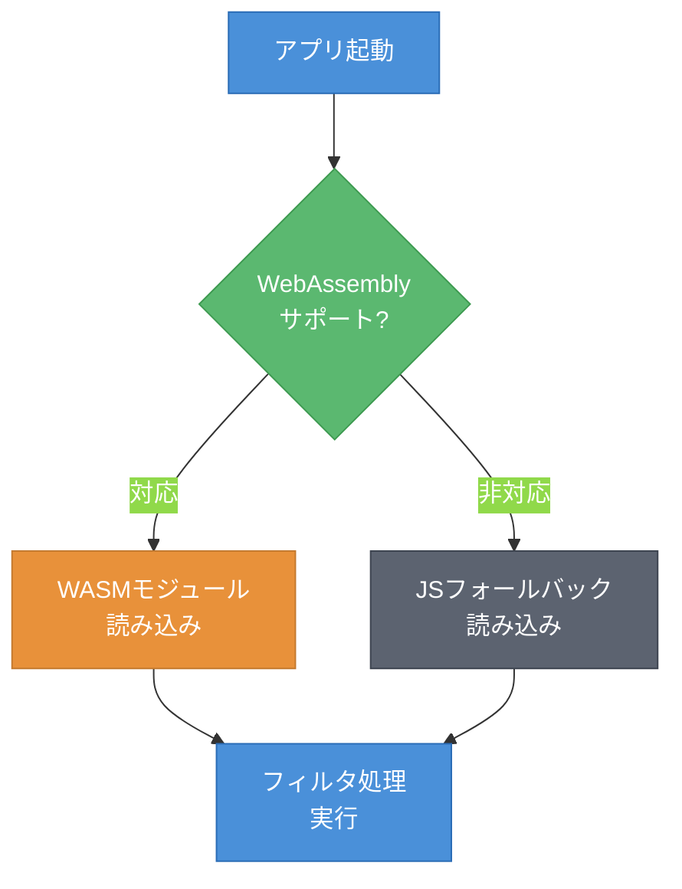
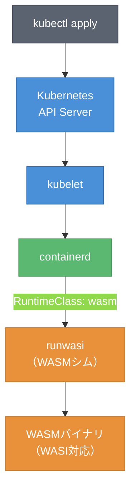
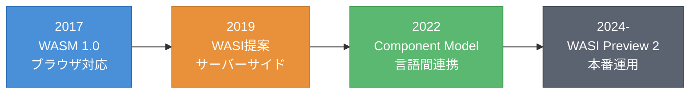

# 第5章 本番環境への道 ― 最適化とデプロイ

第4章でWASMの性能特性を把握し、適用判断基準を獲得した。本章では、サンプルアプリを本番環境で運用する準備をする。バンドルサイズの最適化（Optimization）、ブラウザ互換性への対応、そしてKubernetes上でのWASMワークロードのデプロイを扱う。

---

## 5.1 バンドルサイズ最適化

WASMバイナリのバンドルサイズ（Bundle Size）はネットワーク転送時間に直結する。本書のサンプルアプリは現状約24KBだが、さらに削減できる。

### Cargo.tomlのリリースプロファイル

第2章で設定したリリースプロファイルを確認する。

```toml
[profile.release]
opt-level = "z"    # サイズ最適化
lto = true         # リンク時最適化
codegen-units = 1  # 単一コード生成ユニット（最適化精度向上）
strip = true       # デバッグ情報除去
```

各設定の効果を表5.1に示す。

**表5.1: 最適化手法別のバイナリサイズ比較**[^1]

| 最適化手法 | 設定 | サイズ目安 | 効果 |
|-----------|------|----------|------|
| デフォルト | なし | 〜100KB | ベースライン |
| opt-level = "z" | Cargo.toml | 〜40KB | サイズ優先の最適化 |
| LTO有効 | lto = true | 〜30KB | 未使用コードの除去 |
| strip有効 | strip = true | 〜25KB | デバッグ情報除去 |
| wasm-opt -Oz | 別途実行 | 〜20KB | WASM固有の最適化 |
| gzip圧縮 | サーバー設定 | 〜8KB | 転送時圧縮 |

### wasm-opt

wasm-opt[^2]はWASMバイナリに対してBinaryen最適化パスを適用するツールである。Cargo.tomlの最適化とは独立に、WASM命令レベルでの最適化を行う。

```bash
# wasm-optのインストール（binaryenパッケージに含まれる）
# macOS: brew install binaryen
# Ubuntu: apt install binaryen

# サイズ最適化を適用
wasm-opt -Oz -o optimized.wasm pkg/wasm_image_filter_bg.wasm
```

`-Oz`はサイズ最優先の最適化フラグである。`-O3`（速度優先の最適化）や`-O4`（IRのフラット化を含むより積極的な最適化）との使い分けはデプロイ先の要件による。ブラウザ向けでは転送サイズが重要なため`-Oz`が推奨される。

---

## 5.2 ブラウザ互換性

### サポート状況

主要ブラウザはすべてWebAssembly 1.0をサポートしている。表5.2にブラウザ別のサポート状況を示す。

**表5.2: ブラウザ別WASMサポート状況**[^3]

| ブラウザ | WASMサポート | 対応バージョン |
|---------|------------|--------------|
| Chrome | 対応 | 57以降（2017年3月） |
| Firefox | 対応 | 52以降（2017年3月） |
| Safari | 対応 | 11以降（2017年9月） |
| Edge | 対応 | 16以降（2017年10月） |
| Node.js | 対応 | 8以降（2017年5月） |

2017年以降のモダンブラウザであれば、WASMは追加設定なしで動作する。

### Feature Detection

WASMが利用可能かどうかを実行時に判定するには、`WebAssembly`オブジェクトの存在をチェックする。

```javascript
// Feature Detection: WASMサポートの判定
function isWasmSupported() {
    try {
        if (typeof WebAssembly === 'object'
            && typeof WebAssembly.instantiate === 'function') {
            // 最小限のWASMモジュールをコンパイルして検証
            const module = new WebAssembly.Module(
                new Uint8Array([0, 97, 115, 109, 1, 0, 0, 0])
            );
            return module instanceof WebAssembly.Module;
        }
    } catch (e) {
        // 古いブラウザではWebAssemblyが未定義
    }
    return false;
}

if (isWasmSupported()) {
    // WASMを使用
    const { grayscale } = await import('./pkg/wasm_image_filter.js');
} else {
    // JavaScriptフォールバック
    const { grayscaleJS } = await import('./fallback.js');
}
```

図5.1に、Feature Detectionのフローを示す。



**図5.1: Feature Detectionフロー ― WASM非対応ブラウザではJSフォールバックに切り替える**

動的インポート（`import()`）を使うことで、WASM非対応環境ではWASMモジュールをダウンロードせず、JSフォールバックのみを読み込む。

---

## 5.3 KubernetesでWASMを動かす

WASMはブラウザだけでなく、サーバーサイドでも実行できる。WASI（WebAssembly System Interface）[^4]を通じてファイルI/Oや標準入出力にアクセスし、Kubernetes上でワークロードとして実行する方法を解説する。

### アーキテクチャ

図5.2に、Kubernetes上でWASMを実行するアーキテクチャを示す。



**図5.2: Kubernetes上のWASM実行アーキテクチャ ― runwasiがcontainerdのシムとしてWASMを実行する**

runwasi[^5]はcontainerdのシム（shim）として動作し、通常のコンテナの代わりにWASMバイナリを実行する。Kubernetesから見ると通常のPodと同じように管理できる。

### コンテナとの比較

WASMワークロードはコンテナと比較して以下の利点がある。図5.3に起動時間の比較を示す。


**図5.3: コンテナ vs WASMワークロードの起動時間比較 ― WASMは数ミリ秒で起動する**[^6]

WASMワークロードはOSレベルの仮想化を必要としないため、コンテナの数百ミリ秒に対して数ミリ秒で起動する。

### WASI対応CLI版の実装

WASMバイナリをKubernetes上で実行するには、WASI対応のCLI版が必要である。標準入力から画像データを受け取り、フィルタ処理を行う簡易的な実装を示す。

```rust
// WASI対応CLI版: 標準入力から画像データを読み取りグレースケール変換する
use std::io::{self, Read, Write};

fn main() {
    // 標準入力から画像のRGBAバイト列を読み取る
    let mut input = Vec::new();
    io::stdin().read_to_end(&mut input).unwrap();

    // グレースケール変換（4バイトずつ処理）
    let mut output = Vec::with_capacity(input.len());
    for chunk in input.chunks(4) {
        if chunk.len() == 4 {
            let gray = (0.299 * chunk[0] as f32
                + 0.587 * chunk[1] as f32
                + 0.114 * chunk[2] as f32) as u8;
            output.extend_from_slice(&[gray, gray, gray, chunk[3]]);
        }
    }

    // 標準出力に結果を書き出す
    io::stdout().write_all(&output).unwrap();
}
```

このコードを`wasm32-wasip1`ターゲットでビルドすると、WASIランタイム上で動作するWASMバイナリが生成される。

```bash
# WASI対応ターゲットの追加とビルド
rustup target add wasm32-wasip1
cargo build --target wasm32-wasip1 --release
```

### Kubernetesマニフェスト

WASMワークロードをデプロイするには、RuntimeClassとDeploymentを定義する。

```yaml
# RuntimeClass: WASMランタイムの定義
apiVersion: node.k8s.io/v1
kind: RuntimeClass
metadata:
  name: wasmtime
handler: wasmtime  # 使用するWASMランタイムに応じて変更（wasmtime, spin等）
---
# Deployment: WASMワークロード
apiVersion: apps/v1
kind: Deployment
metadata:
  name: wasm-filter
spec:
  replicas: 1
  selector:
    matchLabels:
      app: wasm-filter
  template:
    metadata:
      labels:
        app: wasm-filter
    spec:
      runtimeClassName: wasmtime
      containers:
        - name: filter
          image: ghcr.io/example/wasm-filter:latest
          command: ["/wasm-filter.wasm"]
```

`runtimeClassName: wasmtime`を指定することで、kubeletがrunwasiシムを使用してWASMバイナリを実行する。通常のコンテナイメージの代わりに、WASMバイナリを含むOCIイメージを指定する。

---

## 5.4 まとめと将来展望

本書では、画像フィルタアプリを段階的に構築しながら、WASMの本質を「ポータブルなバイトコード」として理解してきた。

図5.4に、WASMエコシステムの主要なマイルストーンを示す。



**図5.4: WASMエコシステムのロードマップ ― ブラウザから始まりサーバーサイドへ拡大**

Component Model[^7]は、異なる言語で書かれたWASMモジュール同士を安全に連携させる仕組みである。RustとPythonのWASMモジュールが、共通のインターフェース定義（WIT: WebAssembly Interface Types）を通じて関数を呼び合えるようになる。

WASI Preview 2[^8]は、ファイルシステム、ネットワーク、乱数生成等のシステムインターフェースを標準化する。これにより「一度ビルドすれば、どのWASMランタイムでも動く」というポータビリティが実現する。

本書で学んだ知識 ― WASMバイナリの構造、Rust + wasm-packによるビルド、JavaScriptとの連携、性能特性の理解 ― は、これらの新しい技術を習得する土台となる。WASMの世界はまだ始まったばかりである。

---

## 理解度チェック

### Q1. wasm-optの最適化

**種類**: 概念の確認

**難易度**: 基礎

**問題文**:
wasm-optはどのような最適化を行うツールか。Cargo.tomlのリリースプロファイルによる最適化との違いを説明せよ。

<details>
<summary>解答と解説</summary>

**解答**: wasm-optはWASMバイナリに対してBinaryen最適化パスを適用するツールである。Cargo.tomlのリリースプロファイル（opt-level, LTO等）はRustコンパイラ（rustc/LLVM）がネイティブコード生成時に行う最適化であるのに対し、wasm-optは生成済みのWASMバイナリに対して命令レベルの最適化（不要な命令の除去、制御フローの簡略化等）を行う。両者は独立に適用可能であり、併用することでさらなるサイズ削減が期待できる。

**解説**: 表5.1に示した通り、Cargo.toml設定とwasm-optを組み合わせることで段階的にサイズを削減できる。

**関連する節**: 5.1節

</details>

---

### Q2. Kubernetes上のWASMワークロードの利点

**種類**: 概念の確認

**難易度**: 基礎

**問題文**:
WASMワークロードをKubernetesで実行する利点を、コンテナと比較して2つ挙げよ。

<details>
<summary>解答と解説</summary>

**解答**: (1) 起動時間が短い（コンテナの数百ミリ秒に対してWASMは数ミリ秒）。(2) リソース効率が高い（OSレベルの仮想化が不要で、イメージサイズも小さい）。

**解説**: 図5.3に示した通り、WASMワークロードはコンテナと比較して約100倍高速に起動する。runwasiがcontainerdのシムとして動作し、WASMランタイム上で直接バイナリを実行するため、Linuxカーネルの名前空間やcgroup等のオーバーヘッドがない。

**関連する節**: 5.3節

</details>

---

### Q3. マイクロサービスのWASM移行判断

**種類**: 判断問題

**難易度**: 応用

**問題文**:
既存のNode.jsベースのマイクロサービス（REST API、PostgreSQL接続、Redis キャッシュ）をWASMワークロードに移行すべきか。判断基準とともに回答せよ。

<details>
<summary>解答と解説</summary>

**解答**: 現時点では移行すべきではない。理由は、(1) WASI Preview 2のネットワークAPIはまだ成熟途上であり、PostgreSQLやRedisへの接続が標準的にサポートされていない、(2) Node.jsのエコシステム（ORMライブラリ、認証ミドルウェア等）に相当するWASM向けライブラリが不足している、(3) I/Oバウンドな処理（DB接続、HTTP通信）ではWASMの計算性能の優位性が活きない。ただし、CPU集約的な処理（画像変換、暗号処理等）を行うマイクロサービスであれば、WASMへの部分的な移行を検討する価値がある。

**解説**: 第4章の適用判断フレームワーク（図4.3）に加え、WASIのエコシステム成熟度も判断基準に含める必要がある。図5.4のロードマップに示した通り、WASI Preview 2の安定化に伴い、将来的には適用範囲が広がる可能性がある。

**関連する節**: 5.3節、5.4節

</details>

---

## 参考文献

[^1]: サンプルアプリ（wasm-image-filter）での計測結果。プロジェクトや依存関係により値は変動する。
[^2]: WebAssembly/binaryen, https://github.com/WebAssembly/binaryen
[^3]: Can I use "WebAssembly", https://caniuse.com/wasm
[^4]: WASI (WebAssembly System Interface), https://wasi.dev/
[^5]: containerd/runwasi, https://github.com/containerd/runwasi
[^6]: Fermyon "WebAssembly vs. Containers", https://www.fermyon.com/blog/webassembly-vs-containers
[^7]: WebAssembly Component Model, https://component-model.bytecodealliance.org/
[^8]: WASI Preview 2, https://github.com/WebAssembly/WASI/blob/main/wasip2/README.md
